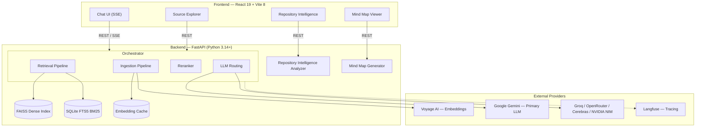

<div align="center">

# ContextForge

**A grounded AI workspace for Retrieval-Augmented Generation.**

Ingest documents, web pages, and GitHub repositories — then query your knowledge base with cited evidence, confidence metrics, and streaming answers.


[Overview](#overview) · [Features](#features) · [Architecture](#architecture) · [Quick Start](#quick-start) · [Configuration](#configuration) · [API Reference](#api-reference) · [Roadmap](#roadmap)

</div>

<br>

> **Project status —** Active development. The core RAG pipeline, Repository Intelligence, and Mind Map features are implemented and tested. See [Roadmap](#roadmap) for what's next.

<br>

## Table of Contents

- [Overview](#overview)
- [Features](#features)
  - [Source Ingestion](#source-ingestion)
  - [Retrieval Pipeline](#retrieval-pipeline)
  - [Answer Delivery](#answer-delivery)
  - [Repository Intelligence](#repository-intelligence)
  - [Mind Map](#mind-map)
- [Architecture](#architecture)
- [Technology Stack](#technology-stack)
- [Quick Start](#quick-start)
- [Configuration](#configuration)
- [Project Structure](#project-structure)
- [API Reference](#api-reference)
- [Development](#development)
- [Roadmap](#roadmap)
- [Contributing](#contributing)
- [License](#license)
- [Acknowledgments](#acknowledgments)

<br>

## Overview

Most LLM chat tools are disconnected from your actual data. ContextForge is built around a single idea: **answers should be grounded in sources you control**, not just a model's training data.

| | |
|---|---|
| **Local-first** | Everything runs on your own hardware. No data leaves your machine except for embedding and LLM API calls. |
| **Hybrid retrieval** | BM25 keyword search and dense vector search, fused via Reciprocal Rank Fusion and sharpened with cross-encoder reranking. |
| **Multi-provider resilience** | Gemini as the primary LLM, with automatic failover to Groq, OpenRouter, Cerebras, or NVIDIA NIM — if one provider is down, the pipeline keeps working. |
| **Transparent answers** | Every response ships with source citations, per-stage latency breakdowns, and server-side confidence metrics, so you know *why* the model answered the way it did. |

<br>

## Features

### Source Ingestion

| Type | Format | Loader |
|---|---|---|
| PDF | `.pdf` | `pypdf` |
| Word | `.docx` | `python-docx` |
| Web page | URL | `trafilatura` |
| GitHub repository | Repository URL | GitHub REST API + AST-aware code chunking |
| YouTube | Video URL | `youtube-transcript-api` |
| Plain text | `.txt` | Raw text loader |

### Retrieval Pipeline

1. **HyDE expansion** *(optional)* — generates a hypothetical answer passage to improve recall
2. **Hybrid search** — BM25 (SQLite FTS5) and dense vector search (FAISS `IndexFlatIP`) run in parallel
3. **Reciprocal Rank Fusion** — merges sparse and dense results into a single ranked list
4. **Cross-encoder reranking** — `cross-encoder/ms-marco-MiniLM-L-6-v2` scores top candidates for relevance
5. **LLM generation** — reranked chunks are passed to the LLM, which produces a grounded, cited answer

### Answer Delivery

- **Streaming** — tokens delivered to the frontend in real time via Server-Sent Events (SSE)
- **Source citations** — every answer shows which ingested chunks were used, with scores and metadata
- **Confidence metrics** — server-side `answer_confidence`, `source_coverage`, `sources_used`, `retrieved_chunks`
- **Latency breakdown** — per-stage timing across retrieval, rerank, and generation

### Repository Intelligence

Point ContextForge at a GitHub repository and it runs a multi-phase static + historical analysis:

| Capability | Description |
|---|---|
| Architecture graph | Hierarchical decomposition: repo → area → directory → module → file |
| Dependency graph | Module-level dependency subgraphs with configurable depth |
| Data-flow analysis | Execution and data-flow paths across the codebase |
| Git history | Churn, branches, commits, and contributor activity |
| Ownership analysis | Contributor distribution and bus-factor estimation |
| Health scoring | Weighted scoring across fanout, churn, complexity, coverage, ownership |
| Risk assessment | Explainable, weighted risk levels per module |
| Change impact | Blast-radius analysis for a proposed change to a file or module |
| Interactive Q&A | Ask natural-language questions about the repository's architecture |

The ingestion layer indexes a repository from the GitHub API; Repository Intelligence additionally clones the repo for deeper static analysis.

### Mind Map

Generate an interactive SVG mind map from any ingested source — with zoom, pan, search, and fullscreen mode.

<br>

## Architecture



*Solid arrows are synchronous REST/SSE calls; the dotted arrow is optional tracing telemetry.*

<br>

## Technology Stack

### Backend

| Component | Technology |
|---|---|
| Framework | FastAPI |
| Runtime | Python 3.14+ |
| Vector store | FAISS (CPU, `IndexFlatIP`) |
| Sparse index | SQLite FTS5 |
| Embeddings | Voyage AI (`voyage-3-lite`) |
| Reranker | `cross-encoder/ms-marco-MiniLM-L-6-v2` |
| LLM (primary) | Google Gemini (`gemini-flash-latest`) |
| LLM (fallback) | Groq, OpenRouter, Cerebras, NVIDIA NIM |
| Tracing | Langfuse *(optional)* |

### Frontend

| Component | Technology |
|---|---|
| Framework | React 19 |
| Build tool | Vite 8 |
| Styling | Tailwind CSS v4 |
| Routing | React Router 7 |
| Animation | Framer Motion |
| Mind map | `@xiangfa/mindmap` |
| Markdown | `react-markdown` + `remark-gfm` |

<br>

## Quick Start

### Prerequisites

- Python 3.14+
- Node.js 22+
- A Voyage AI API key (`VOYAGE_API_KEY`)
- A Google Gemini API key (`GOOGLE_API_KEY`) — primary LLM
- *(Optional)* A Groq API key (`GROQ_API_KEY`) — fallback LLM

### 1 · Backend

```bash
git clone https://github.com/AdnanZamanNiloy/ContexForge.git
cd contextforge

python -m venv .venv && source .venv/bin/activate
pip install -r backend/requirements.txt

# Set API keys as environment variables (never commit them):
export VOYAGE_API_KEY="..."
export GOOGLE_API_KEY="..."

uvicorn backend.app.main:app --reload --port 8000
```

> All settings load via `pydantic-settings` from environment variables or a `.env` file in `backend/`. Secrets are env-only — defaults in `settings.py` are intentionally empty, and the app fails loudly when a required key is missing.

### 2 · Frontend

```bash
cd frontend
npm install
cp .env.example .env    # defaults to http://localhost:8000
npm run dev             # starts on http://localhost:5173
```

### 3 · Verify

```bash
curl http://localhost:8000/health
# → {"status":"ok","service":"contextforge"}
```

Then open **http://localhost:5173** in your browser.

<br>

## Configuration

All configuration lives in `backend/app/config/settings.py` via `pydantic-settings`. Set values through environment variables or a `.env` file in `backend/`.

### Required

| Variable | Description |
|---|---|
| `VOYAGE_API_KEY` | Embedding API key |
| `GOOGLE_API_KEY` | Primary LLM (Gemini) API key |

### Optional

| Variable | Default | Description |
|---|---|---|
| `GROQ_API_KEY` | — | Fallback LLM provider |
| `OPENROUTER_API_KEY` | — | Fallback aggregator |
| `CEREBRAS_API_KEY` | — | Fallback provider |
| `NVIDIA_API_KEY` | — | Fallback provider |
| `LANGFUSE_PUBLIC_KEY` | — | Langfuse tracing (public key) |
| `LANGFUSE_SECRET_KEY` | — | Langfuse tracing (secret key) |
| `LANGFUSE_HOST` | `https://cloud.langfuse.com` | Langfuse host |
| `GEMINI_MODEL` | `gemini-flash-latest` | Gemini model ID |
| `GROQ_MODEL` | `openai/gpt-oss-20b` | Groq model ID |
| `VOYAGE_MODEL` | `voyage-3-lite` | Voyage embedding model |
| `CHUNK_SIZE` | `512` | Text chunk size (tokens) |
| `CHUNK_OVERLAP` | `50` | Chunk overlap (tokens) |
| `TOP_K_RETRIEVAL` | `20` | Chunks retrieved per query |
| `TOP_K_RERANK` | `5` | Chunks passed to the LLM |
| `USE_HYDE` | `false` | Enable HyDE query expansion |
| `FAISS_INDEX_PATH` | `data/vector_store/index.faiss` | FAISS index path |
| `ALLOWED_ORIGINS` | `["http://localhost:5173"]` | CORS allowed origins |
| `REPO_MAX_FILES` | `800` | Max files for repo analysis |
| `LOG_LEVEL` | `INFO` | Logging level |

### Frontend

| Variable | Default | Description |
|---|---|---|
| `VITE_API_BASE_URL` | `http://localhost:8000` | Backend API URL |

<details>
<summary><strong>Additional configuration categories</strong> (click to expand)</summary>
<br>

- **Model selection** — `GEMINI_MODEL`, `GROQ_MODEL`, `VOYAGE_MODEL`, `RERANK_MODEL`
- **Repository analysis** — `REPO_MAX_FILES`, `REPO_CLONE_TIMEOUT`, `REPO_GIT_HISTORY_DAYS`
- **Risk scoring weights** — `RISK_FANOUT_WEIGHT`, `RISK_CHURN_WEIGHT`, `RISK_COMPLEXITY_WEIGHT`, `RISK_COVERAGE_WEIGHT`, `RISK_OWNERSHIP_WEIGHT`
- **Paths** — `FAISS_INDEX_PATH`, `BM25_DB_PATH`, `CACHE_PATH`, `UPLOAD_DIR`, `REPO_ANALYSIS_DIR`, `MINDMAP_DIR`

</details>

<br>

## Project Structure

```
contextforge/
├── backend/
│   ├── app/
│   │   ├── main.py                  # FastAPI entry point, lifespan, CORS, routers
│   │   ├── dependencies.py          # Singleton services (orchestrator, ingest, query)
│   │   ├── config/
│   │   │   └── settings.py          # All app configuration (pydantic-settings)
│   │   ├── routes/                  # API route handlers
│   │   │   ├── ingest.py            # POST /ingest/source, /ingest/file, DELETE, GET /ingest/sources
│   │   │   ├── github.py            # POST /github/ingest
│   │   │   └── query.py             # POST /query, POST /query/stream
│   │   ├── schemas/                 # Pydantic request/response models
│   │   ├── services/
│   │   │   ├── ingest_service.py    # Ingestion orchestration
│   │   │   └── query_service.py     # Query + SSE streaming
│   │   ├── mindmap/                 # Mind map generation (routes, service, storage)
│   │   └── repository_intelligence/ # Repo analysis (graph, risk, git, dependencies, etc.)
│   ├── core/
│   │   ├── orchestrator.py          # Central coordinator for the RAG pipeline
│   │   ├── ingestion/               # Loaders: base, pdf, docx, text, web, github, youtube
│   │   ├── chunking/                # Text chunker (tiktoken) + code chunker (AST)
│   │   ├── embedding/               # Voyage embedder + BGE fallback embedder
│   │   ├── retrieval/               # BM25, dense, hybrid, RRF fusion, HyDE, reranker
│   │   ├── generation/              # LLM abstraction + providers (Gemini, Groq, etc.)
│   │   ├── storage/                 # FAISS store, BM25 index, embedding cache
│   │   ├── processing/              # Cleaner, deduplicator, metadata extractor
│   │   └── interfaces/              # Abstract contracts (embedder, LLM, retriever)
│   ├── observability/tracer.py      # Langfuse tracing decorator
│   └── tests/                       # Unit + integration tests
│       ├── unit/                    # Test modules for each pipeline stage
│       └── integration/             # API-level integration tests
├── frontend/
│   ├── src/
│   │   ├── App.jsx                  # Routes (/, /sources/:id, /mindmap/:id, /repository)
│   │   ├── pages/                   # Page components (Home, SourceExplore, MindMap, Repository)
│   │   ├── components/              # Reusable UI (ChatBox, MindMapCanvas, SourceHeader, etc.)
│   │   ├── hooks/                   # useChat, useSources, useRepository
│   │   ├── services/api.js          # API client (REST + SSE streaming)
│   │   ├── lib/sources.jsx          # Source helper utilities
│   │   └── styles/main.css          # Tailwind CSS v4 + custom styles
│   ├── index.html
│   ├── vite.config.js
│   └── package.json
├── docs/                            # Architecture, pipeline and evaluation notes
├── pyproject.toml                   # Project metadata + ruff config
├── Makefile                         # Dev workflow (install, lint, test, build)
├── .github/workflows/ci.yml         # CI: lint, test and build on push/PR
├── backend/.env.example             # Documented env-var template (no secrets)
└── README.md
```

<br>

## API Reference

<details open>
<summary><strong>Health</strong></summary>
<br>

```
GET  /health                                    Service health check
```

</details>

<details open>
<summary><strong>Ingestion</strong></summary>
<br>

```
POST    /ingest/source                          Ingest a URL or GitHub repo
POST    /ingest/file                            Upload a PDF or DOCX file
DELETE  /ingest/source/{id}                      Remove a source and its chunks
GET     /ingest/sources                          List all ingested sources
DELETE  /ingest/clear                            Wipe the entire knowledge base
```

</details>

<details open>
<summary><strong>Query</strong></summary>
<br>

```
POST    /query                                  Answer a question (JSON: sources + confidence)
POST    /query/stream                           Stream answer tokens via SSE
```

</details>

<details open>
<summary><strong>Repository Intelligence</strong></summary>
<br>

```
POST    /repository/analyze?repo_url=...         Start an analysis (background)
GET     /repository/latest?repo_url=...          Latest completed analysis for a URL
GET     /repository/{id}                         Full analysis bundle
GET     /repository/{id}/status                  Poll analysis status
GET     /repository/{id}/architecture            Architecture graph
GET     /repository/{id}/dependencies?selected=&depth=   Dependency subgraph
GET     /repository/{id}/data-flow               Data flow graph
GET     /repository/{id}/git-history?range=      Git churn and commits
GET     /repository/{id}/ownership               Contributor and bus-factor analysis
GET     /repository/{id}/health                  Health scores
GET     /repository/{id}/repository              Repository header metadata
GET     /repository/{id}/risk-explanations       Risk level descriptions
GET     /repository/{id}/change-impact?path=     Blast radius of a change
GET     /repository/{id}/node?path=              Node / module inspector
POST    /repository/{id}/ask                     Interactive Q&A about the repo
POST    /repository/{id}/reanalyze               Re-run analysis
```

</details>

<details open>
<summary><strong>Mind Map</strong></summary>
<br>

```
POST    /mindmap/generate                       Generate or fetch cached mind map for a source
GET     /mindmap/{source_id}                     Fetch a previously generated mind map
```

</details>

<br>

## Development

The `Makefile` wraps the whole workflow (see `make help`). Everything below can
also be run through it.

### Linting & Formatting

Backend uses [Ruff](https://docs.astral.sh/ruff/); frontend uses ESLint +
Prettier.

```bash
make install      # create the venv + install backend/frontend deps
make lint         # ruff (backend) + eslint/prettier (frontend)
make format       # auto-fix formatting in both
```

### Running Tests

Backend uses `pytest`, frontend uses `vitest`.

```bash
# Backend
cd backend && python -m pytest tests/ -v

# Frontend
cd frontend && npm test
```

### Building the Frontend

```bash
cd frontend
npm run build     # production build into frontend/dist
npm run preview   # preview the production build
```

<br>

## Roadmap

- [ ] Docker Compose deployment with backend + frontend services
- [ ] User authentication and multi-user workspaces
- [ ] Document-level metadata search and filtering
- [ ] Batch ingestion for large document sets
- [ ] Export and share mind maps
- [ ] REST API client SDK for programmatic access
- [ ] CI/CD pipeline with GitHub Actions

<br>

## Contributing

Contributions are welcome. Please open an issue first to discuss the change you'd like to make.

1. Fork the repository
2. Create a feature branch — `git checkout -b feat/my-feature`
3. Make your changes
4. Run the tests
5. Commit and push
6. Open a pull request

<br>

## License

A license has not yet been selected for this project. Until a `LICENSE` file is added, all rights are reserved. Maintainers should choose and add an open-source license before public distribution.

<br>

## Acknowledgments

- [Langfuse](https://langfuse.com) — open-source observability
- [FAISS](https://github.com/facebookresearch/faiss) by Meta Research — vector search
- [Voyage AI](https://www.voyageai.com) — embedding models
- [Trafilatura](https://github.com/adbar/trafilatura) — web content extraction

<br>

<div align="center">

**ContextForge** · maintained by [@AdnanZamanNiloy](https://github.com/AdnanZamanNiloy)

</div>