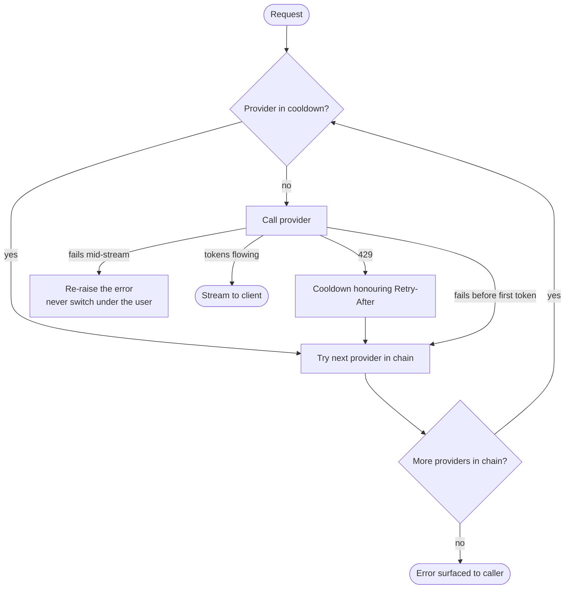
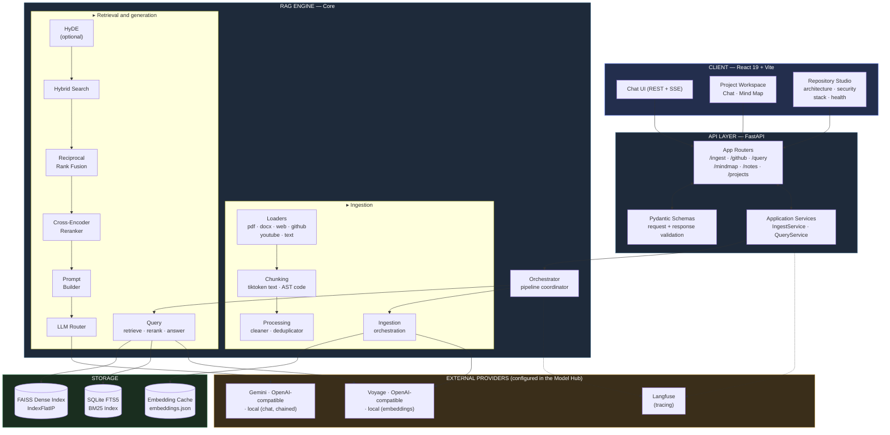
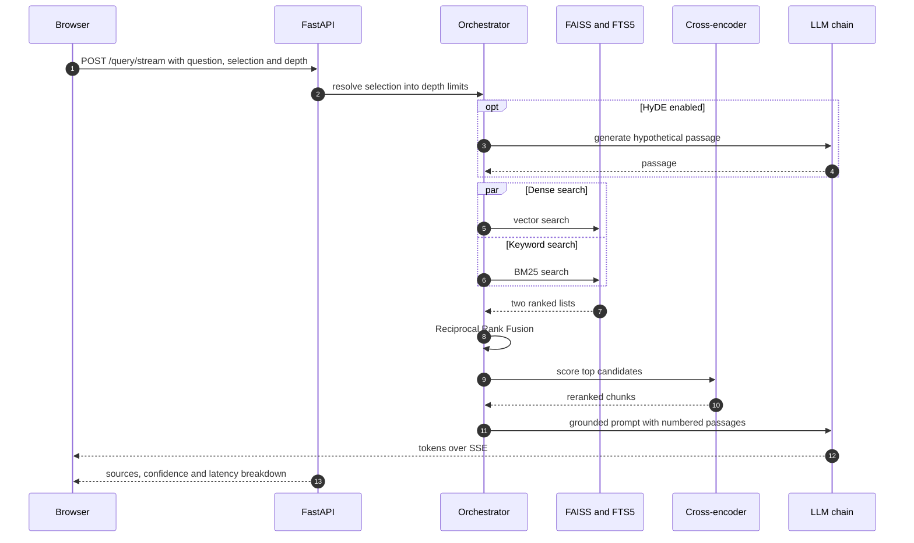

<div align="center">


**A grounded AI workspace for Retrieval-Augmented Generation.**

Point it at your own documents, web pages, YouTube videos and GitHub repositories.
It ingests them, builds a hybrid index, and answers with inline citations, a
confidence score, and a per-stage latency breakdown you can actually audit.

<br>

[](https://www.python.org/)
[](https://nodejs.org/)
[](https://fastapi.tiangolo.com/)
[](https://react.dev/)
[](https://github.com/facebookresearch/faiss)
[](LICENSE)

[](https://github.com/AdnanZamanNiloy/contexforge/actions/workflows/ci.yml)
[](#development)
[](#api-reference)
[](#project-status)

<br>

[Quick start](#quick-start) · [Features](#features) · [How it compares](#how-it-compares) · [Architecture](#architecture) · [Security & privacy](#security--privacy) · [API](#api-reference) · [Docs](#documentation)

</div>

<br>

> **Why this exists.** Most chat tools answer from a model's training data and
> give you no way to check. ContextForge indexes sources *you* control, cites the
> exact passage behind each claim, and tells you when its own confidence is low
> and why.

<!-- TODO: embed a workspace screenshot and a short demo GIF here (store them in docs/assets/). -->

## Highlights

- **Cited, not asserted.** Every answer shows the exact chunks it used, with scores and metadata.
- **Hybrid retrieval.** BM25 (SQLite FTS5) and dense vectors (FAISS) fused with Reciprocal Rank Fusion, then re-scored by a cross-encoder.
- **Honest about cost.** Selecting sources prices the selection against the prompt budget *before* you ask, with no model call, and reports any reduction it had to make.
- **Inspectable sources.** An extraction verdict flags a scanned or half-empty PDF instead of letting it answer as if it had been read.
- **Repository Studio.** Architecture diagrams, security and quality scans, dependency inventory and health hotspots for any GitHub repository.
- **Your models, your keys.** Nine hosted providers or any local OpenAI-compatible server, chained with failover. Keys are entered in the UI and encrypted at rest once `CREDENTIAL_ENCRYPTION_KEY` is set.

## Project Status

Active development. Everything described in [Features](#features) is implemented
and covered by tests; the caveats below are the honest ones.

| Area | State |
|---|---|
| RAG pipeline (hybrid retrieval, RRF, cross-encoder rerank, HyDE) | Shipped, tested |
| Ingestion (PDF, DOCX, TXT, web, YouTube, GitHub) | Shipped, tested |
| Projects, chat sessions, notes, mind map | Shipped, tested |
| Studio (architecture, security, tech stack, health) | Shipped, tested |
| Model Hub (multi-provider, chains, encrypted keys at rest) | Shipped, tested |
| CI on `main` | **Passing** — ruff, format, docs guard, 603 backend tests, eslint, 369 frontend tests, build |
| Container deployment | Not provided — no Dockerfiles ship yet |

*Test counts describe the commit this README ships with. The CI badge above is the live signal.*

### Known Issues

These are real and unfixed. Nothing below is planned-and-hidden.

- **The reranker is English-only.** `cross-encoder/ms-marco-MiniLM-L-6-v2` is an
  English model, so non-English sources are systematically under-scored. The same
  question scores 0.16 in English and 0.98 in the source's own language. Ask in
  the language of the source for accurate results, or swap in a multilingual
  cross-encoder in `RERANK_MODEL` (for example `BAAI/bge-reranker-v2-m3`).
- **Re-ingesting a URL creates a second source** rather than replacing the first,
  so the sidebar accumulates duplicates. Prune them from the source list.
- **No container build.** `docker-compose.yml` is checked in but cannot build:
  both services declare a build context and neither directory has a Dockerfile.
  Run from source.
- **`npm test` needs a constrained pool on low-memory machines.** 31 jsdom
  environments at once will exhaust a 6–8 GB box and report spurious failures.
  GitHub's runner has the headroom; locally, run the files in batches or use
  `--pool=forks --poolOptions.forks.singleFork`.

What ContextForge deliberately does *not* do today is listed under [Scope](#scope-what-contextforge-is-and-is-not), and the plan for the gaps is under [Roadmap](#roadmap).

<br>

## Table of Contents

- [Highlights](#highlights)
- [Project Status](#project-status)
- [Overview](#overview)
- [How it compares](#how-it-compares)
- [Features](#features)
  - [Source Ingestion](#source-ingestion)
  - [Retrieval Pipeline](#retrieval-pipeline)
  - [Answer Delivery](#answer-delivery)
  - [Context Control](#context-control)
  - [Source Inspection](#source-inspection)
  - [Projects](#projects)
  - [Notes](#notes)
  - [Mind Map](#mind-map)
  - [Studio](#studio)
  - [Model Hub](#model-hub)
- [Architecture](#architecture)
- [Technology Stack](#technology-stack)
- [Quick Start](#quick-start)
- [Configuration](#configuration)
- [Deployment & Operations](#deployment--operations)
- [Security & Privacy](#security--privacy)
- [Performance & Scaling](#performance--scaling)
- [Project Structure](#project-structure)
- [API Reference](#api-reference)
- [Documentation](#documentation)
- [Development](#development)
- [Scope](#scope-what-contextforge-is-and-is-not)
- [Roadmap](#roadmap)
- [FAQ](#faq)
- [Contributing](#contributing)
- [License](#license)
- [Acknowledgments](#acknowledgments)

<br>

## Overview

ContextForge is a self-hosted, retrieval-augmented generation (RAG) workspace that turns your own documents, including PDFs, Word files, web pages, YouTube videos, GitHub repositories, and plain text, into a queryable, cited knowledge base. Ingest a source and ask questions in natural language; ContextForge searches across a hybrid index (keyword + dense embeddings), reranks the most relevant passages, and generates a grounded answer with inline source citations, confidence metrics, and per-stage latency breakdowns. Everything runs on your own hardware, and the knowledge base survives restarts via a persistent on-disk store.

Most LLM chat tools are disconnected from your actual data. ContextForge is built around a single idea: **answers should be grounded in sources you control**, not just a model's training data.

| | |
|---|---|
| **Local-first** | Everything runs on your own hardware. No data leaves your machine except for the embedding and LLM calls you configure, and a fully local setup removes even those. See [Security & Privacy](#security--privacy). |
| **Hybrid retrieval** | BM25 keyword search and dense vector search, fused via Reciprocal Rank Fusion and sharpened with cross-encoder reranking. |
| **Bring your own providers** | Add any OpenAI-compatible endpoint (OpenAI, Groq, OpenRouter, Cerebras, NVIDIA NIM, Together, Mistral, DeepSeek, a local server) or Google Gemini from the Model Hub. Chain them and the pipeline fails over down the chain. |
| **Transparent answers** | Every response ships with source citations, per-stage latency breakdowns, and server-side confidence metrics, so you know *why* the model answered the way it did. |

### Design principles

1. **Grounded or silent.** Answers come from the sources you selected. Selection is the primary control, not a hidden default.
2. **Report the cost, never smooth it over.** A reduced depth, a skipped source, or a selected id missing from the index is *said*, not silently absorbed.
3. **No ambient credentials.** Provider keys live in the Model Hub and nowhere else. A model with no saved key fails with a named error instead of quietly using a key from the environment.
4. **Provider-agnostic by interface.** Embedder, LLM and retriever sit behind contracts in `core/interfaces/`. Swapping one is a configuration change, not a rewrite.
5. **Documentation that cannot drift.** The API reference is generated from the running app, and the README's curated API list is checked against the live spec in CI.

<br>

## How it compares

These tools overlap, but they optimise for different things. This section is here to help you choose, including when **not** to choose ContextForge.

> **ContextForge optimises for auditable grounding for one person or a small team**, plus analysis of code repositories. It does not try to match enterprise connector breadth, multi-user administration, or layout-aware parsing of complex documents. Those are real gaps, listed plainly below.

*Compared against public documentation as of October 2026. Products change quickly; see [methodology and sources](#comparison-methodology-and-sources) and please open a PR if something here is out of date.*

### At a glance

| | **ContextForge** | **Gemini Notebook**<br>(formerly NotebookLM) | **AnythingLLM** | **Open WebUI** | **RAGFlow** | **Onyx** |
|---|---|---|---|---|---|---|
| **Shape** | Source-grounded RAG workspace plus repository analyzers | Hosted research notebook | All-in-one private chat, RAG and agent app | General chat UI with built-in RAG | RAG engine focused on deep document parsing | Enterprise search and AI assistant platform |
| **Runs** | Your machine (from source today) | Google's cloud only | Desktop app or Docker | Self-hosted | Self-hosted | Self-hosted or cloud |
| **License** | MIT | Proprietary | MIT | Custom (Open WebUI License) | Apache-2.0 | MIT core; enterprise code under a separate license |
| **Models** | Bring your own: nine hosted providers or any local OpenAI-compatible server, with ordered failover chains | Gemini | 20+ providers | Ollama and OpenAI-compatible | Multiple providers | Any hosted or self-hosted LLM |
| **Retrieval stack** | BM25 (FTS5) + FAISS flat → RRF → local cross-encoder; optional HyDE | Not publicly detailed | Pluggable vector database (LanceDB, Chroma and others) | Hybrid BM25 + vector, optional cross-encoder rerank, many vector DBs | Vector + BM25 + rerank on Elasticsearch or Infinity | Hybrid keyword + semantic with knowledge graph |
| **Knowledge sources** | PDF, DOCX, TXT, web, YouTube, GitHub | Files, Drive, pasted text, websites, YouTube | Uploads, URLs, GitHub, GitLab, YouTube, Confluence, site crawler | Uploads and knowledge bases | Uploads parsed with template-based chunking | 40+ connectors with syncing |
| **Designed for** | People who must *verify* answers; developers studying a repo | Zero-setup research, study aids, audio and video overviews | A turnkey private ChatGPT with agents for a team | A good multi-model chat UI where RAG is one feature | Messy, complex documents at scale | Organisations that need connectors and permission-aware search |
| **Backed by** | Individual maintainer | Google | Mintplex Labs | Open WebUI project | InfiniFlow | Onyx (commercial company) |

### Capability matrix

| Capability | ContextForge | Gemini Notebook | AnythingLLM | Open WebUI | RAGFlow | Onyx |
|---|:-:|:-:|:-:|:-:|:-:|:-:|
| Self-hostable, data stays on your hardware | ✅ | ➖ | ✅ | ✅ | ✅ | ✅ |
| Not locked to one model vendor | ✅ | ➖ | ✅ | ✅ | ✅ | ✅ |
| Inline citations to source passages | ✅ | ✅ | ✅ | ✅ | ✅ | ✅ |
| Multi-user accounts and access control | ➖ | ◐ | ✅ | ✅ | ◐ | ✅ |
| Agents, tool use or MCP | ➖ | ➖ | ✅ | ✅ | ✅ | ✅ |
| Repository analysis (architecture, security, health) | ✅ | ➖ | ➖ | ➖ | ➖ | ➖ |
| Selection cost preview with depth presets | ✅ | ➖ | ➖ | ➖ | ➖ | ➖ |
| Per-answer confidence and per-stage latency | ✅ | ➖ | ➖ | ➖ | ➖ | ➖ |

✅ built in · ◐ partial, or depends on plan or edition · ➖ not offered, or not documented in the public material reviewed.
The last three rows are ContextForge's design bets. A ➖ elsewhere means "not a documented feature", not "impossible to build".

### Choose the right tool

- **Choose Gemini Notebook** if you want zero setup and polished study and audio outputs, and you accept Google-hosted data, Gemini-only models and per-notebook source caps that vary by plan.
- **Choose AnythingLLM** if you want a turnkey, multi-user private ChatGPT with agents, a no-code agent builder and a desktop app.
- **Choose Open WebUI** if you mainly want a strong multi-model chat interface and RAG is one feature among many.
- **Choose RAGFlow** if your hard problem is parsing complex documents with layouts and tables. ContextForge's `pypdf` loader will not match it there, and flags scanned PDFs rather than reading them.
- **Choose Onyx** if you need connectors across 40+ business tools and permission-aware search for an organisation. Per-source permission syncing is an enterprise-edition feature.
- **Choose ContextForge** if verifying an answer matters more than breadth: you want to see what a selection will cost before asking, which exact passages and scores backed each claim, how long each stage took, whether a source was extracted properly, and a codebase you can read and modify.

### What is distinctive by design

1. **Selection pricing before you ask.** The estimator makes no embedding, retrieval, rerank or generation call, so it is free to re-run on every change.
2. **Depth presets that say what they did.** A depth the selection cannot justify is reduced *and the response says so*; sources the depth will not read are named and struck through.
3. **History that stays true.** Each chat message records the exact source selection it was answered with, so re-reading history never shows the answer your *current* selection would produce.
4. **Extraction verdicts.** A source with no text, missing text layers or suspiciously little text is flagged instead of answering as though it had been read.
5. **Repository Studio.** Architecture diagrams where every code node carries its file path, OSV advisories, `ast-grep` findings, dependency inventory and ranked hotspots.
6. **Failover with defined semantics.** Rate-limited providers cool down (honouring `Retry-After`), providers that fail before the first token fall through, and a mid-stream failure re-raises rather than switching underneath you.
7. **No ambient credentials.** Keys are entered in the UI, encrypted at rest when `CREDENTIAL_ENCRYPTION_KEY` is set, and never appear in a response.
8. **Candour as a feature.** Known issues are listed up front, and the README's API list is verified against the live OpenAPI spec in CI.

### Where ContextForge is behind today

- No multi-user accounts, roles or built-in authentication.
- No SaaS connectors (Slack, Confluence, Jira and similar) and no scheduled re-sync of sources.
- No OCR or layout-aware parsing: scanned PDFs are detected and flagged, not read.
- No agents, workflow builder or MCP.
- No container image yet; you run from source.
- English-only default reranker; a single exact (flat) vector index sized for personal and small-team corpora.
- Early-stage project with a single maintainer and no published retrieval benchmarks yet.

### Libraries, not products

LlamaIndex, LangChain and Haystack are libraries for *building* RAG systems; ContextForge is a finished application you run. PrivateGPT, relaunched in June 2026, is positioned as an open-source API layer for RAG rather than a chat workspace. If you need to embed retrieval inside your own product, start with a library or an API layer. If you need a workspace to ask questions of your sources and check the answers, start here.

<details>
<summary><strong id="comparison-methodology-and-sources">Comparison methodology and sources</strong></summary>
<br>

Facts about other products come from their own documentation and repositories where possible, cross-checked against independent write-ups, and reflect what was publicly documented in October 2026. Closed products (Gemini Notebook) do not disclose their retrieval internals, so that cell says so rather than guessing. Vendor-stated figures (for example Onyx's scale claims) are not independently verified. Corrections are welcome.

- Gemini Notebook rename and positioning: [Google announcement](https://blog.google/innovation-and-ai/products/gemini-notebook/notebooklm-gemini-notebook/) · [Workspace Updates](https://workspaceupdates.googleblog.com/2026/07/notebooklm-now-gemini-notebook.html)
- AnythingLLM: [repository](https://github.com/Mintplex-Labs/anything-llm) · [ingestion and data connectors](https://deepwiki.com/Mintplex-Labs/anything-llm/9-document-ingestion)
- Open WebUI: [documentation comparison with Onyx](https://docs.openwebui.com/alternatives/onyx)
- RAGFlow: [repository](https://github.com/infiniflow/ragflow) · [DataCamp overview](https://www.datacamp.com/tutorial/ragflow)
- Onyx: [repository](https://github.com/onyx-dot-app/onyx) · [licensing and editions](https://wz-it.com/en/blog/onyx-self-hosted-installation/)
- PrivateGPT: [repository](https://github.com/zylon-ai/private-gpt)

</details>

<br>

## Features

### Source Ingestion

| Type | Format | Loader |
|---|---|---|
| PDF | `.pdf` | `pypdf` |
| Word | `.docx` | `python-docx` |
| Web page | URL | `trafilatura` |
| GitHub repository | Repository URL | GitHub REST API + AST-aware code chunking |
| YouTube | Video URL | `youtube-transcript-api` |
| Plain text | `.txt` | Raw text loader |

Text is chunked by token count (`tiktoken`, 512 tokens with 50 overlap by default); code is chunked along its syntax tree. Chunks are cleaned and deduplicated before they are embedded, and embeddings are cached so re-ingesting the same content is cheap.

### Retrieval Pipeline

1. **HyDE expansion** *(optional)* — generates a hypothetical answer passage to improve recall
2. **Hybrid search** — BM25 (SQLite FTS5) and dense vector search (FAISS `IndexFlatIP`) run in parallel
3. **Reciprocal Rank Fusion** — merges sparse and dense results into a single ranked list
4. **Cross-encoder reranking** — `cross-encoder/ms-marco-MiniLM-L-6-v2` scores top candidates for relevance
5. **LLM generation** — reranked chunks are passed to the LLM, which produces a grounded, cited answer

RRF needs no score normalisation, which matters because BM25 scores and cosine similarities live on different scales. Details per stage are in [Pipeline](docs/pipeline.md).

### Answer Delivery

- **Streaming** — tokens delivered to the frontend in real time via Server-Sent Events (SSE)
- **Source citations** — every answer shows which ingested chunks were used, with scores and metadata
- **Confidence metrics** — server-side `answer_confidence`, `source_coverage`, `sources_used`, `retrieved_chunks`
- **Latency breakdown** — per-stage timing across retrieval, rerank, and generation

The confidence numbers are a signal for *where to look*, not a guarantee of correctness. [Evaluation](docs/evaluation.md) explains what they do and do not mean.

### Context Control

Selecting sources is the workspace's primary control, and it reports what it costs
instead of being a silent one. The sidebar prices the current selection against
the prompt budget on every change — and the estimator makes **no** embedding,
retrieval, rerank or generation call, so it is free to re-run.

Three depths map to concrete retrieval limits, so widening the depth does
something measurable:

| Depth | Max sources | Retrieved | Reranked to | Per-source cap |
|---|---|---|---|---|
| `focused` | 2 | 20 | 5 | 4 |
| `balanced` | 6 | 40 | 12 | 6 |
| `broad` | 25 | 80 | 25 | 10 |

The reported numbers are deliberately not smoothed over: a depth the selection
cannot justify is **reduced and the response says so**, sources the depth will not
read are **named and struck through**, and selected ids missing from the index are
**reported separately** from sources found — "I selected it" and "it is
contributing" are different facts.

`POST /context/estimate` · `GET /query` accepts `context_depth`

### Source Inspection

A source that extracted badly is indistinguishable from a healthy one until you
look: it appears, gets cited, and answers questions as though it had been read. A
scanned PDF and a healthy one look the same in the sidebar.

- `GET /ingest/source/{id}` — an **extraction verdict** (no text at all, some pages
  with no text layer, suspiciously little text), plus page counts, detected
  language, and the indexed file list for a repository.
- `GET /ingest/source/{id}/content` — the indexed chunk text retrieval would quote.

There is deliberately no original-file download. `UPLOAD_DIR` is configured but
unused: ContextForge indexes uploads without retaining the bytes, so the panel
says so rather than offering a control that cannot work.

`PATCH /ingest/source/{id}` renames a source; `DELETE` removes it.

### Projects

A project is a private workspace: its own sources, its own chat history, and its
own analysis target. Membership is reconciled against the live index on every
read, so a deleted source cannot linger in a project or inflate its source count.

`GET|POST /projects` · `GET|PATCH|DELETE /projects/{id}` ·
`POST|DELETE /projects/{id}/sources` · `PUT /projects/{id}/tool-source`

Chat sessions persist per project in SQLite, and **each message records the exact
source selection it was answered with** — so re-reading history after you change
the workspace selection shows the answer you actually got, not the answer the
current selection would produce.

### Notes

Pick one source or several, and the system writes a structured Markdown note from
their indexed content — the same act as a mind map, in prose instead of a diagram.
The selection is the cache key, so a note is generated once and reused until the
selection changes; `refresh` forces a regeneration.

The prompt is about writing, not summarising: it leads with the point rather than
naming the subject the heading already names, requires a section heading that
carries its argument, and requires three or more discrete things to become a list.
Notes carry **no** `[n]` passage markers.

`POST /note/generate` · `GET /note/{key}` · output downloadable as `.md`

### Mind Map

Generate an interactive SVG mind map from any ingested source — or from a
selection of several — with zoom, pan, search, and fullscreen mode. Notes and mind
maps share one notion of a selection, so both cache side by side over the same
sources.

`POST /mindmap/generate` · `GET /mindmap/{key}`

### Studio

Four repository analyzers. Each targets one repository (resolved from an explicit
request, then the project's remembered tool source, then its first GitHub member)
and caches against a content fingerprint, so an unchanged repository is analysed
once.

| Tool | Route | Output |
|---|---|---|
| Architecture Diagram | `POST /architecture/generate` (SSE) | Mermaid diagram of the real request and domain paths, every code node carrying the exact file path it came from |
| Security & Quality | `POST /security/scan` | Dependency advisories (OSV), code-level findings via `ast-grep`, and quality rules |
| Dependency & Tech Stack | `POST /tech-stack/scan` | Manifest and lockfile inventory with per-service detection |
| Health Score & Hotspots | `POST /health/scan` | Structural risk scoring and ranked hotspots |

Each has a `/rescan` variant that ignores the cache and a `GET /{project_id}`
that returns the stored result.

### Model Hub

There is **no built-in provider order.** You register models in the UI, then serve
either a single model or an ordered fallback chain. A provider returning `429` is
put in cooldown (honouring `Retry-After`) and the next one in the chain answers;
providers that fail before emitting a single token fall through, and one that fails
mid-stream re-raises rather than switching underneath the user.


```mermaid
flowchart TD
    A([Request]) --> B{Provider in cooldown?}
    B -- yes --> N[Try next provider in chain]
    B -- no --> C[Call provider]
    C -- 429 --> D[Cooldown honouring Retry-After] --> N
    C -- fails before first token --> N
    C -- fails mid-stream --> E[Re-raise the error<br/>never switch under the user]
    C -- tokens flowing --> F([Stream to client])
    N --> G{More providers in chain?}
    G -- yes --> B
    G -- no --> H([Error surfaced to caller])
```

Nine hosted providers are configurable — OpenAI, Google Gemini, Groq, OpenRouter,
Cerebras, NVIDIA NIM, Together, Mistral, DeepSeek — plus any local
OpenAI-compatible server (llama.cpp, Ollama, vLLM, LM Studio).

Keys are **encrypted at rest** with Fernet when `CREDENTIAL_ENCRYPTION_KEY` is set.
Ciphertexts are self-describing (`enc:v1:`), so a database holding a mix of
plaintext and encrypted rows reads correctly row by row. An undecryptable key
reports `has_api_key: false` and asks for the key again, rather than returning
garbage that `bool()` would treat as usable. Keys never appear in a response.

`GET|POST /models` · `POST /models/{id}/test` (a real call, not a mock — an
embedding probe also auto-detects and persists the vector dimension) ·
`GET|POST /chains` · `GET|PUT /serving`

<br>

## Architecture

ContextForge is a **client–server system** organised into four layers. The frontend is a single-page React app that talks to a FastAPI backend over REST and Server-Sent Events (SSE). The backend wraps a retrieval-augmented generation (RAG) engine behind an *orchestrator*, which coordinates the loading, chunking, indexing, retrieval and generation stages. Ingestion and query are two separate flows that share the same storage layer.


```mermaid
flowchart TB
    classDef frontend fill:#232e4d,stroke:#5b7cfa,color:#fff
    classDef backend  fill:#1e2a3a,stroke:#3f6d8e,color:#fff
    classDef storage  fill:#1a2e1f,stroke:#3f8e5f,color:#fff
    classDef external fill:#3a2e1a,stroke:#c29a3f,color:#fff

    subgraph FE["CLIENT — React 19 + Vite"]
        direction TB
        Chat["Chat UI (REST + SSE)"]
        Workspace["Project Workspace<br/>Chat · Mind Map"]
        Repo["Repository Studio<br/>architecture · security<br/>stack · health"]
    end

    subgraph API["API LAYER — FastAPI"]
        direction TB
        Routes["App Routers<br/>/ingest · /github · /query<br/>/mindmap · /notes · /projects"]
        Schemas["Pydantic Schemas<br/>request + response validation"]
        Services["Application Services<br/>IngestService · QueryService"]
    end

    subgraph CORE["RAG ENGINE — Core"]
        direction TB
        Orchestrator["Orchestrator<br/>pipeline coordinator"]
        subgraph INGEST["▸ Ingestion"]
            direction LR
            Ingest["Ingestion<br/>orchestration"]
            Loaders["Loaders<br/>pdf · docx · web · github<br/>youtube · text"]
            Chunking["Chunking<br/>tiktoken text · AST code"]
            Processing["Processing<br/>cleaner · deduplicator"]
        end
        subgraph QUERY["▸ Retrieval and generation"]
            direction LR
            Query["Query<br/>retrieve · rerank · answer"]
            HyDE["HyDE<br/>(optional)"]
            Hybrid["Hybrid Search"]
            RRF["Reciprocal<br/>Rank Fusion"]
            Rerank["Cross-Encoder<br/>Reranker"]
            Prompt["Prompt<br/>Builder"]
            Router["LLM Router"]
        end
    end

    subgraph STORE["STORAGE"]
        direction LR
        FAISS[("FAISS Dense Index<br/>IndexFlatIP")]
        FTS[("SQLite FTS5<br/>BM25 Index")]
        Cache[("Embedding Cache<br/>embeddings.json")]
    end

    subgraph EXT["EXTERNAL PROVIDERS (configured in the Model Hub)"]
        direction LR
        Embed["Voyage · OpenAI-compatible<br/>· local (embeddings)"]
        LLM["Gemini · OpenAI-compatible<br/>· local (chat, chained)"]
        Trace["Langfuse<br/>(tracing)"]
    end

    Chat --> Routes
    Workspace --> Routes
    Repo --> Routes

    Routes <--> Schemas
    Routes <--> Services
    Services --> Orchestrator

    Orchestrator --> Ingest
    Orchestrator --> Query

    Loaders --> Chunking --> Processing
    Ingest --> Cache
    Ingest --> Embed

    HyDE --> Hybrid
    Hybrid --> RRF --> Rerank --> Prompt --> Router
    Query --> FAISS
    Query --> FTS
    Query --> Embed

    Router --> LLM

    Orchestrator -.-> Trace
    Services -.-> Trace

    class FE frontend
    class API,CORE backend
    class STORE storage
    class EXT external
```

*Solid arrows are synchronous REST/SSE or in-process calls. The dotted arrows are optional Langfuse tracing telemetry. The client never touches storage or providers directly — everything is mediated by the API layer and the orchestrator.*

### The two flows

**Ingestion** (`Loaders → Chunking → Processing`) pulls a source, splits it into digestible chunks, cleans and deduplicates them, then embeds and indexes them into FAISS (dense) and SQLite FTS5 (sparse). The embedding is cached so re-ingesting the same source is cheap.

**Query** (`HyDE → Hybrid → RRF → Rerank → Prompt → LLM Router`) turns a question into a ranked, relevance-scored set of chunks: optional HyDE expansion, parallel hybrid search, reciprocal rank fusion, cross-encoder reranking, then prompt construction and LLM routing.

### Request lifecycle


```mermaid
sequenceDiagram
    autonumber
    participant U as Browser
    participant A as FastAPI
    participant O as Orchestrator
    participant I as FAISS and FTS5
    participant R as Cross-encoder
    participant L as LLM chain

    U->>A: POST /query/stream with question, selection and depth
    A->>O: resolve selection into depth limits
    opt HyDE enabled
        O->>L: generate hypothetical passage
        L-->>O: passage
    end
    par Dense search
        O->>I: vector search
    and Keyword search
        O->>I: BM25 search
    end
    I-->>O: two ranked lists
    O->>O: Reciprocal Rank Fusion
    O->>R: score top candidates
    R-->>O: reranked chunks
    O->>L: grounded prompt with numbered passages
    L-->>U: tokens over SSE
    A-->>U: sources, confidence and latency breakdown
```

### Layer by layer

| Layer | Responsibility | Key modules |
|---|---|---|
| **Client** | Render UI, stream answers, show sources & confidence | `frontend/src/` (`pages/`, `components/`, `hooks/`) |
| **API** | Validate requests, orchestrate services, expose REST/SSE | `backend/app/routes/`, `app/services/`, `app/schemas/` |
| **RAG engine** | Coordinate the pipeline: chunk → index → retrieve → generate | `backend/core/orchestrator.py`, `core/ingestion/`, `core/retrieval/`, `core/generation/` |
| **Storage** | Persist dense, sparse, and cached representations | `backend/core/storage/` |
| **Providers** | Embeddings, LLMs, tracing | `backend/core/generation/`, `backend/observability/` |

The architecture is deliberately **provider-agnostic**: every external capability (embedder, LLM, retriever) sits behind an interface in `core/interfaces/`, so swapping the embedder or the LLM is a matter of registering a different model in the Model Hub, not a code change.

<br>

## Technology Stack

### Backend

| Component | Technology |
|---|---|
| Framework | FastAPI |
| Runtime | Python 3.14+ |
| Vector store | FAISS (CPU, `IndexFlatIP`) |
| Sparse index | SQLite FTS5 |
| Embeddings | Voyage AI, any OpenAI-compatible endpoint, or a local model |
| Reranker | `cross-encoder/ms-marco-MiniLM-L-6-v2` |
| LLMs | Configured in the Model Hub: Gemini, any OpenAI-compatible endpoint, or a local model |
| Fallback chains | Ordered provider chains, resolved at request time |
| Tracing | Langfuse *(optional)* |

### Frontend

| Component | Technology |
|---|---|
| Framework | React 19 |
| Build tool | Vite 8 |
| Styling | Tailwind CSS v4 |
| Routing | React Router 7 |
| Animation | Framer Motion |
| Mind map | `@xiangfa/mindmap` |
| Markdown | `react-markdown` + `remark-gfm` |

<br>

## Quick Start

### Prerequisites

- Python 3.14+
- Node.js 22+
- At least one embedding model and one chat model, each with its API key (or a local server that needs none)

**No API key goes in the environment.** Add them in the app instead: open
**Model Hub** (http://localhost:5173/models), add a model, paste its key, save,
then select it under Serving. Keys are stored encrypted and handed to the
provider at call time. See [Model Hub](#model-hub).

The app starts and every screen loads with nothing configured. Only the actions
that need a provider fail, and they name the model that needs a key.

### 1 · Backend

```bash
git clone https://github.com/AdnanZamanNiloy/contexforge.git
cd contexforge

make install                                  # venv + deps for both halves
cp backend/.env.example backend/.env          # no API keys needed here
make dev-backend                              # FastAPI on :8000
```

> **Why not `uvicorn backend.app.main:app`?** Every module inside `backend/app/`
> imports `from app.…`, so `app` has to be the package and `backend/` the working
> directory. `make dev-backend` runs `cd backend && uvicorn app.main:app`, or you
> can pass `--app-dir backend` from the repo root.

> All settings load via `pydantic-settings` from environment variables or a `.env` file in `backend/`. Secrets are env-only — defaults in `settings.py` are intentionally empty, and the app fails loudly when a required key is missing.

### 2 · Frontend

```bash
make dev-frontend                             # Vite on :5173
```

### 3 · Verify

```bash
curl http://localhost:8000/health
# → {"status":"ok","service":"contextforge"}
```

Then open **http://localhost:5173** in your browser, and open **Model Hub** to add
a model and put it in service. Until you do, generation raises
`NotConfiguredError` — this is deliberate. See [Model Hub](#model-hub).

### 4 · Your first five minutes

1. **Model Hub → add an embedding model** and paste its key (or point it at a local server). Use **test** to run a real call; an embedding probe also detects and saves the vector dimension.
2. **Model Hub → add a chat model**, then select it under **Serving**. To get failover, create a chain of two or more models and serve the chain instead.
3. **Create a project** and **add a source**: upload a PDF or DOCX, or paste a web, YouTube or GitHub URL.
4. **Open the source panel** and read the extraction verdict. A source that extracted badly should be fixed or removed *before* you trust answers from it.
5. **Select sources, pick a depth**, and watch the cost estimate update. Then ask a question and read the citations, confidence and latency breakdown that come back with the answer.

### 5 · Fully local setup

Nothing about ContextForge requires a hosted API. To keep all model traffic on your machine:

1. Run a local OpenAI-compatible server (llama.cpp, Ollama, vLLM or LM Studio).
2. In **Model Hub**, add a **local embedding model** and a **local chat model** pointing at that server's base URL.
3. Serve them. Reranking already runs locally; the cross-encoder weights are fetched once on first use unless they are already cached.

Remote *sources* (web pages, YouTube transcripts, GitHub repositories) still need network access to fetch. See [What leaves your machine](#what-leaves-your-machine).

### 6 · Container deployment (not yet available)

`docker-compose.yml` is checked in, but **it cannot build**: it declares
`build: ./backend` and `build: ./frontend`, and neither directory contains a
`Dockerfile`. Running `docker compose up --build` fails at the first build step.

Treat the compose file as a starting point rather than a working deployment. The
two Dockerfiles it needs are tracked as a known gap in
[Project Status](#project-status). Run from source with `make dev-backend` and
`npm run dev` in the meantime.

<br>

## Configuration

All configuration lives in `backend/app/config/settings.py` via `pydantic-settings`. Set values through environment variables or a `.env` file in `backend/`. A documented template ships as `backend/.env.example`.

### Required

None. `.env` carries paths, chunking sizes, optional tracing, and the Fernet key
used to encrypt Model Hub credentials.

### Recommended

| Variable | Description |
|---|---|
| `CREDENTIAL_ENCRYPTION_KEY` | Fernet key protecting provider keys stored in the Model Hub. Without it those keys are written to `backend/data/model_hub/model_hub.db` **in plaintext** and the app warns once. |

Generate a key once and keep it somewhere safe (a password manager or secrets store):

```bash
python -c "from cryptography.fernet import Fernet; print(Fernet.generate_key().decode())"
```

Losing the key does not corrupt anything: affected models report `has_api_key: false` and ask for their key again.

### Provider credentials are not environment variables

Every provider key, embedding included, is entered in the **Model Hub UI** and
stored in SQLite. `settings.py` reads no provider credential at all.

The environment used to supply `VOYAGE_API_KEY` and `GOOGLE_API_KEY` as a silent
fallback for a Model Hub row with no saved key. That made a misconfigured install
look correctly configured: requests succeeded against a credential the UI never
displayed, so a user who deleted a key in the app had no way to know it was still
being used. A model with no key now raises a named error pointing at Model Hub.

`dependencies.get_llm()` returns a not-configured sentinel until the Model Hub
serves something.

### Optional

| Variable | Default | Description |
|---|---|---|
| `LANGFUSE_PUBLIC_KEY` | — | Langfuse tracing (public key) |
| `LANGFUSE_SECRET_KEY` | — | Langfuse tracing (secret key) |
| `LANGFUSE_HOST` | `https://cloud.langfuse.com` | Langfuse host |
| `VOYAGE_MODEL` | `voyage-3-lite` | Voyage embedding model |
| `GEMINI_MODEL` | `gemini-flash-latest` | Default model ID for a Gemini entry |
| `RERANK_MODEL` | `cross-encoder/ms-marco-MiniLM-L-6-v2` | Cross-encoder used for reranking. Swap for a multilingual model to fix [non-English scoring](#known-issues) |
| `CHUNK_SIZE` | `512` | Text chunk size (tokens) |
| `CHUNK_OVERLAP` | `50` | Chunk overlap (tokens) |
| `TOP_K_RETRIEVAL` | `20` | Chunks retrieved per query |
| `TOP_K_RERANK` | `5` | Chunks passed to the LLM |
| `USE_HYDE` | `false` | Enable HyDE query expansion |
| `FAISS_INDEX_PATH` | `data/vector_store/index.faiss` | FAISS index path |
| `ALLOWED_ORIGINS` | `["http://localhost:5173"]` | CORS allowed origins (JSON list) |
| `LOG_LEVEL` | `INFO` | Logging level |

### Frontend

| Variable | Default | Description |
|---|---|---|
| `VITE_API_BASE_URL` | `http://localhost:8000` | Backend API URL. Vite reads it at **build time**, so rebuild after changing it |

<details>
<summary><strong>Additional configuration categories</strong> (click to expand)</summary>
<br>

- **Model selection** — `GEMINI_MODEL`, `VOYAGE_MODEL`, `RERANK_MODEL`
- **Paths** — `FAISS_INDEX_PATH`, `BM25_DB_PATH`, `CACHE_PATH`, `UPLOAD_DIR` (configured but unused, see [Source Inspection](#source-inspection)), `MINDMAP_DIR`

</details>

<br>

## Deployment & Operations

ContextForge is designed to run as a long-lived process on a machine you control. There is no container image yet, so production today means running from source.

### Running the backend

```bash
cd backend && uvicorn app.main:app --host 127.0.0.1 --port 8000
```

- **Run a single worker.** The orchestrator, FAISS index and other services are in-process singletons, so extra workers would each hold their own copy of the index.
- Run it under a process manager (systemd, supervisord) with `backend/` as the working directory, and restart on failure.
- **Liveness:** `GET /health` returns `{"status":"ok","service":"contextforge"}`.
- **Logging:** set `LOG_LEVEL`. Optional Langfuse tracing is described under [Security & Privacy](#security--privacy).

### Serving the frontend

```bash
cd frontend
VITE_API_BASE_URL=https://api.example.com npm run build   # static output in frontend/dist
```

Serve `frontend/dist` from any static host or reverse proxy, and add that origin to `ALLOWED_ORIGINS`.

### Reverse proxy

Answers and the architecture diagram stream over SSE, so the proxy must not buffer those responses. For nginx:

```nginx
location ~ ^/(query/stream|architecture/generate)$ {
    proxy_pass http://127.0.0.1:8000;
    proxy_http_version 1.1;
    proxy_set_header Connection "";
    proxy_buffering off;          # let tokens through as they arrive
    proxy_read_timeout 300s;
}
```

### Authentication

ContextForge has no built-in user authentication. If it is reachable by anyone other than you, put it behind a reverse proxy that authenticates (basic auth, or an OIDC-aware proxy) and bind the backend to `127.0.0.1`. See [Scope](#scope-what-contextforge-is-and-is-not).

### State and backups

All persistent state is on disk, by default under `backend/data/`:

| State | Where it comes from |
|---|---|
| Dense index | `FAISS_INDEX_PATH` |
| Keyword index | `BM25_DB_PATH` (SQLite FTS5) |
| Embedding cache | `CACHE_PATH` |
| Model registry, chains, encrypted keys | `backend/data/model_hub/model_hub.db` |
| Generated mind maps | `MINDMAP_DIR` |

To back up: stop the backend, copy the data directory, start the backend. **Store `CREDENTIAL_ENCRYPTION_KEY` separately from the backup**; a backup that contains both the database and the key defeats the encryption. To restore, put the directory back and supply the same key.

### Upgrading

Back up first, then `git pull`, `make install`, and restart. Run `make lint` and the test suites if you have local changes.

<br>

## Security & Privacy

### What leaves your machine

ContextForge is local-first, not offline-only. Exactly what is sent, and to whom, depends on the models you configure:

| Action | What is sent | To |
|---|---|---|
| Ingest a file | Text chunks | Your **embedding** model (nothing leaves if it is local) |
| Ask a question | The question, plus the retrieved passages | Your **chat** model or chain (nothing leaves if it is local); the question also goes to the embedding model |
| HyDE *(optional)* | The question | Your chat model |
| Reranking | Nothing | Runs locally |
| Ingest a web page, YouTube video or GitHub repository | A request for that resource | The target site, YouTube, or the GitHub REST API |
| Dependency scan (Studio) | Package names and versions | OSV |
| Tracing *(optional)* | Trace data | `LANGFUSE_HOST` (cloud by default; point it at a self-hosted Langfuse to keep traces local) |

With a local embedder, a local chat server, and tracing off, the only outbound traffic is whatever you ask it to fetch.

### Credential handling

- Provider keys are entered in the Model Hub, never read from the environment, and **never returned in an API response**.
- With `CREDENTIAL_ENCRYPTION_KEY` set, keys are encrypted at rest with Fernet. Ciphertexts are self-describing (`enc:v1:`), so mixed plaintext and encrypted rows read correctly.
- Without the key, keys are stored in plaintext and the app warns once. Set it.
- A key that cannot be decrypted is reported as absent (`has_api_key: false`) rather than used.

### Threat model in brief

- **In scope:** keeping provider credentials out of logs, responses and source control; making clear what is sent where.
- **Out of scope today:** user authentication, per-user data isolation and network-level protection. Treat the backend as a trusted-network service, as described under [Authentication](#authentication).
- **Untrusted content:** ingested documents and web pages are data, but they are passed to an LLM. Treat answers derived from sources you do not control with the same care you would give the sources themselves.

### Reporting a vulnerability

Please **do not** open a public issue for a security problem. Use GitHub's private vulnerability reporting (the **Security** tab of the repository). Include the version or commit, reproduction steps, and the impact you believe it has.

<br>

## Performance & Scaling

- **Exact search.** `IndexFlatIP` is brute-force: results are exact with no approximate-recall trade-off, and query cost grows linearly with the number of chunks. It is well suited to personal and small-team corpora. A different index would sit behind the same interfaces (see the [Roadmap](#roadmap)).
- **Parallel retrieval.** BM25 and dense search run concurrently, then fuse.
- **Cheap re-ingest.** The embedding cache means re-ingesting unchanged content does not pay for embeddings twice.
- **Cached analyses.** Notes and mind maps are keyed by the selection; Studio results are keyed by a content fingerprint of the repository. Unchanged inputs are not recomputed.
- **Measure, don't guess.** Every answer carries a per-stage latency breakdown, so you can see whether retrieval, reranking or generation dominates *on your hardware with your models*.
- **No published benchmarks yet.** Retrieval-quality and throughput numbers are on the [Roadmap](#roadmap). Until then, treat any figure you have not measured yourself as unverified.

<br>

## Project Structure

```
contexforge/
├── backend/
│   ├── app/
│   │   ├── main.py                  # FastAPI entry point, lifespan, CORS, routers
│   │   ├── dependencies.py          # Singleton services (orchestrator, ingest, query)
│   │   ├── config/
│   │   │   └── settings.py          # All app configuration (pydantic-settings)
│   │   ├── routes/                  # HTTP surface: ingest, github, query
│   │   ├── schemas/                 # Pydantic request/response models
│   │   ├── services/                # Ingestion + query orchestration
│   │   ├── chat/                    # Chat sessions, stored per project
│   │   ├── context/                 # Selection cost estimation, depth resolution
│   │   ├── projects/                # Project library and membership
│   │   ├── sources/                 # Source records, icons, renames
│   │   ├── notes/                   # Note generation from a selection
│   │   ├── mindmap/                 # Mind map generation (routes, service, storage)
│   │   ├── model_hub/               # Model registry, chains, encrypted keys, factory
│   │   ├── architecture/            # Repository architecture diagram
│   │   ├── techstack/               # Dependency and tech stack report
│   │   ├── health/                  # Health score and hotspots
│   │   └── security/                # CVE scan, local secret and licence checks
│   ├── core/
│   │   ├── orchestrator.py          # Central coordinator for the RAG pipeline
│   │   ├── ingestion/               # Loaders: base, pdf, docx, text, web, github, youtube
│   │   ├── chunking/                # Text chunker (tiktoken) + code chunker (AST)
│   │   ├── embedding/               # Voyage, OpenAI-compatible and local embedders
│   │   ├── retrieval/               # BM25, dense, hybrid, RRF fusion, HyDE, reranker
│   │   ├── generation/              # LLM abstraction: Gemini, OpenAI-compatible,
│   │   │                            # local, plus fallback chains, grounding, citations
│   │   ├── storage/                 # FAISS store, BM25 index, embedding cache
│   │   ├── processing/              # Cleaner, deduplicator, metadata extractor
│   │   └── interfaces/              # Abstract contracts (embedder, LLM, retriever)
│   ├── observability/tracer.py      # Langfuse tracing decorator
│   └── tests/                       # Unit + integration tests
│       ├── unit/                    # Test modules for each pipeline stage
│       └── integration/             # API-level integration tests
├── frontend/
│   ├── src/
│   │   ├── App.jsx                  # Routes (/, /projects, /projects/:id, /models)
│   │   ├── pages/                   # Page components (Home, Projects, ModelHub)
│   │   ├── components/              # Reusable UI (ChatBox, MindMapCanvas, SourceViewer, etc.)
│   │   ├── hooks/                   # useChat, useSources
│   │   ├── services/api.js          # API client (REST + SSE streaming)
│   │   ├── lib/sources.jsx          # Source helper utilities
│   │   └── styles/main.css          # Tailwind CSS v4 + custom styles
│   ├── index.html
│   ├── vite.config.js
│   └── package.json
├── docs/                            # Getting started, architecture, pipeline, evaluation,
│   │                                # troubleshooting, and brand assets
│   └── assets/                      # logo.svg, wordmark.svg (used by this README)
├── pyproject.toml                   # Project metadata + ruff config
├── Makefile                         # Dev workflow (install, lint, test, build)
├── .github/workflows/ci.yml         # CI: lint, test and build on push/PR
├── backend/.env.example             # Documented env-var template (no secrets)
└── README.md
```

<br>

## API Reference

**The complete, always-current API reference is generated from the running
application** and served by FastAPI — it cannot drift from the code:

| | |
|---|---|
| **http://localhost:8000/docs** | Swagger UI — try every endpoint from the browser |
| **http://localhost:8000/redoc** | ReDoc — better for reading top to bottom |
| **http://localhost:8000/openapi.json** | The raw OpenAPI 3.1 spec (43 paths, 59 operations) |

This section is deliberately **curated, not exhaustive** — the calls you are
likely to make by hand. Everything else is one click away at `/docs`.

```
Health
GET  /health                              Liveness check

Ingest
POST /ingest/source                       Ingest a URL or GitHub repo
POST /ingest/file                         Upload a PDF or DOCX
GET  /ingest/sources                      List indexed sources
GET  /ingest/source/{source_id}           Extraction verdict and provenance
GET  /ingest/source/{source_id}/content   The indexed chunk text
PATCH /ingest/source/{source_id}          Rename a source
DELETE /ingest/source/{source_id}         Remove a source and its chunks

Ask
POST /query                               Answer (JSON: passages, scores, confidence)
POST /query/stream                        Stream answer tokens over SSE
POST /context/estimate                    Price a selection against the prompt budget

Turn a selection into something
POST /mindmap/generate                    Generate or fetch the cached mind map
GET  /mindmap/{key}                       Fetch a stored mind map
POST /note/generate                       Generate or fetch the cached note
GET  /note/{key}                          Fetch a stored note

Projects
GET  /projects                            List projects
POST /projects                            Create a project
GET  /projects/{project_id}               One project
POST /projects/{project_id}/sources       Attach a source to a project

Studio (repository analyzers)
POST /architecture/generate               Architecture diagram (SSE)
POST /security/scan                       Security and quality scan
POST /tech-stack/scan                     Dependency and tech stack
POST /health/scan                         Structural health and hotspots

Model Hub
GET  /models                              List configured models (keys redacted)
POST /models                              Add a model (LLM or embedding, API or local)
POST /models/{model_id}/test              Live-test a model
GET  /serving                             Current serving configuration
PUT  /serving                             Select the served model or chain (applies live)
```

> The list above is checked against the live spec in CI — see
> `backend/scripts/check_readme_api.py`. Adding an endpoint without updating this
> curated set, or documenting one that does not exist, fails the build.

<br>

## Documentation

| Guide | Read it when |
|---|---|
| [Getting started](docs/getting-started.md) | Ingesting your first source, per format, and confirming it worked |
| [Troubleshooting](docs/troubleshooting.md) | Something is wrong and you have a symptom |
| [Pipeline](docs/pipeline.md) | What each retrieval stage does |
| [Architecture](docs/architecture.md) | Changing the code — layout, data flow, feature packages |
| [Evaluation](docs/evaluation.md) | What the confidence numbers do and do not mean |

The full API reference is generated from the running application at
**`/docs`** — see [API Reference](#api-reference).

<br>

## Development

The `Makefile` wraps the whole workflow (see `make help`). Everything below can
also be run through it.

### Linting & Formatting

Backend uses [Ruff](https://docs.astral.sh/ruff/); frontend uses ESLint +
Prettier.

```bash
make install      # create the venv + install backend/frontend deps
make lint         # ruff (backend) + eslint/prettier (frontend)
make format       # auto-fix formatting in both
```

### Running Tests

Backend uses `pytest`, frontend uses `vitest`.

```bash
# Backend
cd backend && python -m pytest tests/ -v

# Frontend
cd frontend && npm test

# Frontend, one worker. Use this on a machine with less than ~8 GB: the default
# pool starts one jsdom environment per file and 31 of them will exhaust a small
# box, reporting failures that are really out-of-memory.
cd frontend && npx vitest run --pool=forks --poolOptions.forks.singleFork
```

### Building the Frontend

```bash
cd frontend
npm run build     # production build into frontend/dist
npm run preview   # preview the production build
```

### What CI enforces

Every push and pull request runs: `ruff` lint and format checks, the docs guard (README API list versus the live OpenAPI spec), the backend `pytest` suite, `eslint`, the frontend `vitest` suite, and a production build. A change is mergeable when all of them pass.

<br>

## Scope: what ContextForge is and is not

Clear boundaries are part of being production-grade. As of this release:

| ContextForge is | ContextForge is not (yet) |
|---|---|
| A self-hosted workspace for one person or a small trusted group | A multi-tenant service with accounts, roles or per-user isolation |
| A way to ask questions of sources you choose, and check the answers | An enterprise search layer with SaaS connectors and permission syncing |
| A text-first indexer with extraction verdicts | An OCR or layout-aware parser for scanned or table-heavy documents |
| A set of repository analyzers | An autonomous agent or workflow builder |
| Runnable from source on a laptop or server | Packaged as a container image or a managed cloud service |

<br>

## Roadmap

Ordered by how directly each item closes a [Known Issue](#known-issues) or a gap in [Scope](#scope-what-contextforge-is-and-is-not). These are intentions, not commitments, and priorities follow what real users hit first.

**Next: close the known issues**

- [ ] Working `Dockerfile`s for backend and frontend, so `docker compose up --build` succeeds
- [ ] Multilingual reranking, ideally chosen from the language the extraction verdict already detects
- [ ] Replace-on-reingest for URL sources, so re-ingesting no longer duplicates
- [ ] Make the default frontend test pool safe on low-memory machines

**Under consideration**

- [ ] Published retrieval-quality benchmarks and a reproducible evaluation harness
- [ ] Optional approximate-nearest-neighbour index for larger corpora
- [ ] OCR for scanned PDFs, building on the existing extraction verdict
- [ ] Built-in authentication and per-user workspaces
- [ ] Additional loaders and scheduled source re-sync

Want something prioritised? Open an issue describing the problem you are trying to solve.

<br>

## FAQ

<details>
<summary><strong>Does my data leave my machine?</strong></summary>
<br>

Only through the models and services you configure. With a local embedder, a local chat server, and tracing off, nothing is sent anywhere except the requests you make to fetch remote sources. See [What leaves your machine](#what-leaves-your-machine).

</details>

<details>
<summary><strong>Can I run it fully offline?</strong></summary>
<br>

Yes for model traffic, using local embedding and chat models (see [Fully local setup](#5--fully-local-setup)). Ingesting a URL, a YouTube video or a GitHub repository obviously needs the network, and the reranker weights are fetched once on first use unless cached.

</details>

<details>
<summary><strong>Why not just use NotebookLM (now Gemini Notebook)?</strong></summary>
<br>

If it fits, do. It is polished and needs no setup. ContextForge exists for people who want self-hosting, the freedom to choose any model, repository analysis, and an answer they can audit: selection pricing, per-message selection history, extraction verdicts, confidence and latency. See [How it compares](#how-it-compares).

</details>

<details>
<summary><strong>Why is there no default model, and why aren't API keys in <code>.env</code>?</strong></summary>
<br>

A default hides what your install is actually using. Keys in the environment once acted as a silent fallback that made a misconfigured install look healthy. Now every credential is visible in the Model Hub, and a model without a key fails with a named error.

</details>

<details>
<summary><strong>What does the confidence score mean?</strong></summary>
<br>

It is a server-side signal derived from retrieval, not a probability that the answer is correct. Use it to decide where to look more closely. [Evaluation](docs/evaluation.md) covers what it does and does not tell you.

</details>

<details>
<summary><strong>Why an exact FAISS index instead of HNSW or IVF?</strong></summary>
<br>

For personal and small-team corpora, exact search is fast enough and removes approximate-recall error from the list of things that can go wrong. Larger corpora would want an approximate index, which is on the [Roadmap](#roadmap).

</details>

<details>
<summary><strong>Non-English documents score poorly. What should I do?</strong></summary>
<br>

That is the English-only reranker, a [Known Issue](#known-issues). Ask in the language of the source, or set `RERANK_MODEL` to a multilingual cross-encoder.

</details>

<br>

## Contributing

Contributions are welcome. Please open an issue first to discuss the change you'd like to make.

1. Fork the repository
2. Create a feature branch — `git checkout -b feat/my-feature`
3. Make your changes
4. Run `make lint` and the tests
5. If you add, remove or change an endpoint, update the curated list in [API Reference](#api-reference); CI fails when it drifts from the live spec
6. Commit and push
7. Open a pull request

If you spot something out of date in [How it compares](#how-it-compares), a pull request with a source link is the fastest fix.

<br>

## License

Released under the [MIT License](LICENSE). See the `LICENSE` file for the full
text.

<br>

## Acknowledgments

- [FastAPI](https://fastapi.tiangolo.com/), [React](https://react.dev/) and [Vite](https://vite.dev/) — the application foundation
- [FAISS](https://github.com/facebookresearch/faiss) by Meta Research — vector search
- [SQLite FTS5](https://www.sqlite.org/fts5.html) — keyword search
- [Voyage AI](https://www.voyageai.com) — embedding models
- [Trafilatura](https://github.com/adbar/trafilatura) — web content extraction
- [Langfuse](https://langfuse.com) — open-source observability
- [OSV](https://osv.dev) and [ast-grep](https://ast-grep.github.io/) — advisories and code-level analysis in Studio
- [Mermaid](https://mermaid.js.org/) — architecture diagrams

<br>

<div align="center">

**ContextForge** · maintained by [@AdnanZamanNiloy](https://github.com/AdnanZamanNiloy)

</div>