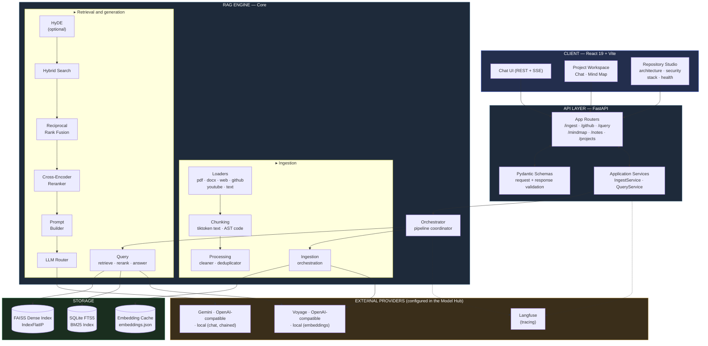

<div align="center">


**A grounded AI workspace for Retrieval-Augmented Generation.**

Point it at your own documents, web pages, YouTube videos and GitHub repositories.
It ingests them, builds a hybrid index, and answers with inline citations, a
confidence score, and a per-stage latency breakdown you can actually audit.

<br>

[](https://www.python.org/)
[](https://nodejs.org/)
[](https://fastapi.tiangolo.com/)
[](https://react.dev/)
[](https://github.com/facebookresearch/faiss)
[](LICENSE)

[](.github/workflows/ci.yml)
[](#development)
[](#api-reference)
[](#project-status)

<br>

</div>

<br>

> **Why this exists.** Most chat tools answer from a model's training data and
> give you no way to check. ContextForge indexes sources *you* control, cites the
> exact passage behind each claim, and tells you when its own confidence is low
> and why.

## Project Status

Active development. Everything described in [Features](#features) is implemented
and covered by tests; the caveats below are the honest ones.

| Area | State |
|---|---|
| RAG pipeline (hybrid retrieval, RRF, cross-encoder rerank, HyDE) | Shipped, tested |
| Ingestion (PDF, DOCX, TXT, web, YouTube, GitHub) | Shipped, tested |
| Projects, chat sessions, notes, mind map | Shipped, tested |
| Studio (architecture, security, tech stack, health) | Shipped, tested |
| Model Hub (multi-provider, chains, encrypted keys at rest) | Shipped, tested |
| CI on `main` | **Failing** — see [Known Issues](#known-issues) |
| Container deployment | Not provided — no Dockerfiles ship yet |

### Known Issues

- **CI is red on `main`.** The workflow fails at the `ruff format --check` gate
  on 13 files that were never reformatted. The fix exists on the
  `source-trust-and-context` and `reliability-hardening` branches; it has not
  been merged. Frontend lint, tests and build pass; backend tests are skipped
  because lint fails first.
- **The reranker is English-only.** `cross-encoder/ms-marco-MiniLM-L-6-v2` is an
  English model, so non-English sources are systematically under-scored. Ask in
  the source's own language for accurate results.
- **Re-ingesting a URL creates a second source** rather than replacing the first.
  Prune duplicates from the source list.

<br>

## Table of Contents

- [Project Status](#project-status)
- [Overview](#overview)
- [Features](#features)
  - [Source Ingestion](#source-ingestion)
  - [Retrieval Pipeline](#retrieval-pipeline)
  - [Answer Delivery](#answer-delivery)
  - [Context Control](#context-control)
  - [Source Inspection](#source-inspection)
  - [Projects](#projects)
  - [Notes](#notes)
  - [Mind Map](#mind-map)
  - [Studio](#studio)
  - [Model Hub](#model-hub)
- [Architecture](#architecture)
- [Technology Stack](#technology-stack)
- [Quick Start](#quick-start)
- [Configuration](#configuration)
- [Project Structure](#project-structure)
- [API Reference](#api-reference)
- [Documentation](#documentation)
- [Development](#development)
- [Contributing](#contributing)
- [License](#license)
- [Acknowledgments](#acknowledgments)

<br>

## Overview

ContextForge is a self-hosted, retrieval-augmented generation (RAG) workspace that turns your own documents, including PDFs, Word files, web pages, YouTube videos, GitHub repositories, and plain text, into a queryable, cited knowledge base. Ingest a source and ask questions in natural language; ContextForge searches across a hybrid index (keyword + dense embeddings), reranks the most relevant passages, and generates a grounded answer with inline source citations, confidence metrics, and per-stage latency breakdowns. Everything runs on your own hardware, and the knowledge base survives restarts via a persistent on-disk store.

Most LLM chat tools are disconnected from your actual data. ContextForge is built around a single idea: **answers should be grounded in sources you control**, not just a model's training data.

| | |
|---|---|
| **Local-first** | Everything runs on your own hardware. No data leaves your machine except for embedding and LLM API calls. |
| **Hybrid retrieval** | BM25 keyword search and dense vector search, fused via Reciprocal Rank Fusion and sharpened with cross-encoder reranking. |
| **Bring your own providers** | Add any OpenAI-compatible endpoint (OpenAI, Groq, OpenRouter, Cerebras, NVIDIA NIM, Together, Mistral, DeepSeek, a local server) or Google Gemini from the Model Hub. Chain them and the pipeline fails over down the chain. |
| **Transparent answers** | Every response ships with source citations, per-stage latency breakdowns, and server-side confidence metrics, so you know *why* the model answered the way it did. |

<br>

## Features

### Source Ingestion

| Type | Format | Loader |
|---|---|---|
| PDF | `.pdf` | `pypdf` |
| Word | `.docx` | `python-docx` |
| Web page | URL | `trafilatura` |
| GitHub repository | Repository URL | GitHub REST API + AST-aware code chunking |
| YouTube | Video URL | `youtube-transcript-api` |
| Plain text | `.txt` | Raw text loader |

### Retrieval Pipeline

1. **HyDE expansion** *(optional)* — generates a hypothetical answer passage to improve recall
2. **Hybrid search** — BM25 (SQLite FTS5) and dense vector search (FAISS `IndexFlatIP`) run in parallel
3. **Reciprocal Rank Fusion** — merges sparse and dense results into a single ranked list
4. **Cross-encoder reranking** — `cross-encoder/ms-marco-MiniLM-L-6-v2` scores top candidates for relevance
5. **LLM generation** — reranked chunks are passed to the LLM, which produces a grounded, cited answer

### Answer Delivery

- **Streaming** — tokens delivered to the frontend in real time via Server-Sent Events (SSE)
- **Source citations** — every answer shows which ingested chunks were used, with scores and metadata
- **Confidence metrics** — server-side `answer_confidence`, `source_coverage`, `sources_used`, `retrieved_chunks`
- **Latency breakdown** — per-stage timing across retrieval, rerank, and generation

### Context Control

Selecting sources is the workspace's primary control, and it reports what it costs
instead of being a silent one. The sidebar prices the current selection against
the prompt budget on every change — and the estimator makes **no** embedding,
retrieval, rerank or generation call, so it is free to re-run.

Three depths map to concrete retrieval limits, so widening the depth does
something measurable:

| Depth | Max sources | Retrieved | Reranked to | Per-source cap |
|---|---|---|---|---|
| `focused` | 2 | 20 | 5 | 4 |
| `balanced` | 6 | 40 | 12 | 6 |
| `broad` | 25 | 80 | 25 | 10 |

The reported numbers are deliberately not smoothed over: a depth the selection
cannot justify is **reduced and the response says so**, sources the depth will not
read are **named and struck through**, and selected ids missing from the index are
**reported separately** from sources found — "I selected it" and "it is
contributing" are different facts.

`POST /context/estimate` · `GET /query` accepts `context_depth`

### Source Inspection

A source that extracted badly is indistinguishable from a healthy one until you
look: it appears, gets cited, and answers questions as though it had been read. A
scanned PDF and a healthy one look the same in the sidebar.

- `GET /ingest/source/{id}` — an **extraction verdict** (no text at all, some pages
  with no text layer, suspiciously little text), plus page counts, detected
  language, and the indexed file list for a repository.
- `GET /ingest/source/{id}/content` — the indexed chunk text retrieval would quote.

There is deliberately no original-file download. `UPLOAD_DIR` is configured but
unused: ContextForge indexes uploads without retaining the bytes, so the panel
says so rather than offering a control that cannot work.

`PATCH /ingest/source/{id}` renames a source; `DELETE` removes it.

### Projects

A project is a private workspace: its own sources, its own chat history, and its
own analysis target. Membership is reconciled against the live index on every
read, so a deleted source cannot linger in a project or inflate its source count.

`GET|POST /projects` · `GET|PATCH|DELETE /projects/{id}` ·
`POST|DELETE /projects/{id}/sources` · `PUT /projects/{id}/tool-source`

Chat sessions persist per project in SQLite, and **each message records the exact
source selection it was answered with** — so re-reading history after you change
the workspace selection shows the answer you actually got, not the answer the
current selection would produce.

### Notes

Pick one source or several, and the system writes a structured Markdown note from
their indexed content — the same act as a mind map, in prose instead of a diagram.
The selection is the cache key, so a note is generated once and reused until the
selection changes; `refresh` forces a regeneration.

The prompt is about writing, not summarising: it leads with the point rather than
naming the subject the heading already names, requires a section heading that
carries its argument, and requires three or more discrete things to become a list.
Notes carry **no** `[n]` passage markers.

`POST /note/generate` · `GET /note/{key}` · output downloadable as `.md`

### Mind Map

Generate an interactive SVG mind map from any ingested source — or from a
selection of several — with zoom, pan, search, and fullscreen mode. Notes and mind
maps share one notion of a selection, so both cache side by side over the same
sources.

`POST /mindmap/generate` · `GET /mindmap/{key}`

### Studio

Four repository analyzers. Each targets one repository (resolved from an explicit
request, then the project's remembered tool source, then its first GitHub member)
and caches against a content fingerprint, so an unchanged repository is analysed
once.

| Tool | Route | Output |
|---|---|---|
| Architecture Diagram | `POST /architecture/generate` (SSE) | Mermaid diagram of the real request and domain paths, every code node carrying the exact file path it came from |
| Security & Quality | `POST /security/scan` | Dependency advisories (OSV), code-level findings via `ast-grep`, and quality rules |
| Dependency & Tech Stack | `POST /tech-stack/scan` | Manifest and lockfile inventory with per-service detection |
| Health Score & Hotspots | `POST /health/scan` | Structural risk scoring and ranked hotspots |

Each has a `/rescan` variant that ignores the cache and a `GET /{project_id}`
that returns the stored result.

### Model Hub

There is **no built-in provider order.** You register models in the UI, then serve
either a single model or an ordered fallback chain. A provider returning `429` is
put in cooldown (honouring `Retry-After`) and the next one in the chain answers;
providers that fail before emitting a single token fall through, and one that fails
mid-stream re-raises rather than switching underneath the user.

Nine hosted providers are configurable — OpenAI, Google Gemini, Groq, OpenRouter,
Cerebras, NVIDIA NIM, Together, Mistral, DeepSeek — plus any local
OpenAI-compatible server (llama.cpp, Ollama, vLLM, LM Studio).

Keys are **encrypted at rest** with Fernet when `CREDENTIAL_ENCRYPTION_KEY` is set.
Ciphertexts are self-describing (`enc:v1:`), so a database holding a mix of
plaintext and encrypted rows reads correctly row by row. An undecryptable key
reports `has_api_key: false` and asks for the key again, rather than returning
garbage that `bool()` would treat as usable. Keys never appear in a response.

`GET|POST /models` · `POST /models/{id}/test` (a real call, not a mock — an
embedding probe also auto-detects and persists the vector dimension) ·
`GET|POST /chains` · `GET|PUT /serving`

<br>

## Architecture

ContextForge is a **client–server system** organised into four layers. The frontend is a single-page React app that talks to a FastAPI backend over REST and Server-Sent Events (SSE). The backend wraps a retrieval-augmented generation (RAG) engine behind an *orchestrator*, which coordinates the loading, chunking, indexing, retrieval and generation stages. Ingestion and query are two separate flows that share the same storage layer.


```mermaid
flowchart TB
    classDef frontend fill:#232e4d,stroke:#5b7cfa,color:#fff
    classDef backend  fill:#1e2a3a,stroke:#3f6d8e,color:#fff
    classDef storage  fill:#1a2e1f,stroke:#3f8e5f,color:#fff
    classDef external fill:#3a2e1a,stroke:#c29a3f,color:#fff

    subgraph FE["CLIENT — React 19 + Vite"]
        direction TB
        Chat["Chat UI (REST + SSE)"]
        Workspace["Project Workspace<br/>Chat · Mind Map"]
        Repo["Repository Studio<br/>architecture · security<br/>stack · health"]
    end

    subgraph API["API LAYER — FastAPI"]
        direction TB
        Routes["App Routers<br/>/ingest · /github · /query<br/>/mindmap · /notes · /projects"]
        Schemas["Pydantic Schemas<br/>request + response validation"]
        Services["Application Services<br/>IngestService · QueryService"]
    end

    subgraph CORE["RAG ENGINE — Core"]
        direction TB
        Orchestrator["Orchestrator<br/>pipeline coordinator"]
        subgraph INGEST["▸ Ingestion"]
            direction LR
            Ingest["Ingestion<br/>orchestration"]
            Loaders["Loaders<br/>pdf · docx · web · github<br/>youtube · text"]
            Chunking["Chunking<br/>tiktoken text · AST code"]
            Processing["Processing<br/>cleaner · deduplicator"]
        end
        subgraph QUERY["▸ Retrieval and generation"]
            direction LR
            Query["Query<br/>retrieve · rerank · answer"]
            HyDE["HyDE<br/>(optional)"]
            Hybrid["Hybrid Search"]
            RRF["Reciprocal<br/>Rank Fusion"]
            Rerank["Cross-Encoder<br/>Reranker"]
            Prompt["Prompt<br/>Builder"]
            Router["LLM Router"]
        end
    end

    subgraph STORE["STORAGE"]
        direction LR
        FAISS[("FAISS Dense Index<br/>IndexFlatIP")]
        FTS[("SQLite FTS5<br/>BM25 Index")]
        Cache[("Embedding Cache<br/>embeddings.json")]
    end

    subgraph EXT["EXTERNAL PROVIDERS (configured in the Model Hub)"]
        direction LR
        Embed["Voyage · OpenAI-compatible<br/>· local (embeddings)"]
        LLM["Gemini · OpenAI-compatible<br/>· local (chat, chained)"]
        Trace["Langfuse<br/>(tracing)"]
    end

    Chat --> Routes
    Workspace --> Routes
    Repo --> Routes

    Routes <--> Schemas
    Routes <--> Services
    Services --> Orchestrator

    Orchestrator --> Ingest
    Orchestrator --> Query

    Loaders --> Chunking --> Processing
    Ingest --> Cache
    Ingest --> Embed

    HyDE --> Hybrid
    Hybrid --> RRF --> Rerank --> Prompt --> Router
    Query --> FAISS
    Query --> FTS
    Query --> Embed

    Router --> LLM

    Orchestrator -.-> Trace
    Services -.-> Trace

    class FE frontend
    class API,CORE backend
    class STORE storage
    class EXT external
```

*Solid arrows are synchronous REST/SSE or in-process calls. The dotted arrows are optional Langfuse tracing telemetry. The client never touches storage or providers directly — everything is mediated by the API layer and the orchestrator.*

### The two flows

**Ingestion** (`Loaders → Chunking → Processing`) pulls a source, splits it into digestible chunks, cleans and deduplicates them, then embeds and indexes them into FAISS (dense) and SQLite FTS5 (sparse). The embedding is cached so re-ingesting the same source is cheap.

**Query** (`HyDE → Hybrid → RRF → Rerank → Prompt → LLM Router`) turns a question into a ranked, relevance-scored set of chunks: optional HyDE expansion, parallel hybrid search, reciprocal rank fusion, cross-encoder reranking, then prompt construction and LLM routing.

Layer by layer:

| Layer | Responsibility | Key modules |
|---|---|---|
| **Client** | Render UI, stream answers, show sources & confidence | `frontend/src/` (`pages/`, `components/`, `hooks/`) |
| **API** | Validate requests, orchestrate services, expose REST/SSE | `backend/app/routes/`, `app/services/`, `app/schemas/` |
| **RAG engine** | Coordinate the pipeline: chunk → index → retrieve → generate | `backend/core/orchestrator.py`, `core/ingestion/`, `core/retrieval/`, `core/generation/` |
| **Storage** | Persist dense, sparse, and cached representations | `backend/core/storage/` |
| **Providers** | Embeddings, LLMs, tracing | `backend/core/generation/`, `backend/observability/` |

The architecture is deliberately **provider-agnostic**: every external capability (embedder, LLM, retriever) sits behind an interface in `core/interfaces/`, so swapping the embedder or the LLM is a matter of registering a different model in the Model Hub, not a code change.

<br>

## Technology Stack

### Backend

| Component | Technology |
|---|---|
| Framework | FastAPI |
| Runtime | Python 3.14+ |
| Vector store | FAISS (CPU, `IndexFlatIP`) |
| Sparse index | SQLite FTS5 |
| Embeddings | Voyage AI, any OpenAI-compatible endpoint, or a local model |
| Reranker | `cross-encoder/ms-marco-MiniLM-L-6-v2` |
| LLMs | Configured in the Model Hub: Gemini, any OpenAI-compatible endpoint, or a local model |
| Fallback chains | Ordered provider chains, resolved at request time |
| Tracing | Langfuse *(optional)* |

### Frontend

| Component | Technology |
|---|---|
| Framework | React 19 |
| Build tool | Vite 8 |
| Styling | Tailwind CSS v4 |
| Routing | React Router 7 |
| Animation | Framer Motion |
| Mind map | `@xiangfa/mindmap` |
| Markdown | `react-markdown` + `remark-gfm` |

<br>

## Quick Start

### Prerequisites

- Python 3.14+
- Node.js 22+
- At least one embedding model and one chat model, each with its API key

**No API key goes in the environment.** Add them in the app instead: open
**Model Hub** (http://localhost:5173/models), add a model, paste its key, save,
then select it under Serving. Keys are stored encrypted and handed to the
provider at call time. See [Model Hub](#model-hub) below.

The app starts and every screen loads with nothing configured. Only the actions
that need a provider fail, and they name the model that needs a key.

### 1 · Backend

```bash
git clone https://github.com/AdnanZamanNiloy/ContexForge.git
cd contextforge

make install                                  # venv + deps for both halves
cp backend/.env.example backend/.env          # no API keys needed here
make dev-backend                              # FastAPI on :8000
```

> **Why not `uvicorn backend.app.main:app`?** Every module inside `backend/app/`
> imports `from app.…`, so `app` has to be the package and `backend/` the working
> directory. `make dev-backend` runs `cd backend && uvicorn app.main:app`, or you
> can pass `--app-dir backend` from the repo root.

> All settings load via `pydantic-settings` from environment variables or a `.env` file in `backend/`. Secrets are env-only — defaults in `settings.py` are intentionally empty, and the app fails loudly when a required key is missing.

### 2 · Frontend

```bash
make dev-frontend                             # Vite on :5173
```

### 3 · Verify

```bash
curl http://localhost:8000/health
# → {"status":"ok","service":"contextforge"}
```

Then open **http://localhost:5173** in your browser, and open **Model Hub** to add
a model and put it in service. Until you do, generation raises
`NotConfiguredError` — this is deliberate. See [Model Hub](#model-hub).

### 4 · Container deployment (not yet available)

`docker-compose.yml` is checked in, but **it cannot build**: it declares
`build: ./backend` and `build: ./frontend`, and neither directory contains a
`Dockerfile`. Running `docker compose up --build` fails at the first build step.

Treat the compose file as a starting point rather than a working deployment. The
two Dockerfiles it needs are tracked as a known gap in
[Project Status](#project-status). Run from source with `make dev-backend` and
`npm run dev` in the meantime.

<br>

## Configuration

All configuration lives in `backend/app/config/settings.py` via `pydantic-settings`. Set values through environment variables or a `.env` file in `backend/`.

### Required

.env has no required entries. It carries paths, chunking sizes, optional
tracing, and the Fernet key used to encrypt Model Hub credentials.

### Recommended

| Variable | Description |
|---|---|
| `CREDENTIAL_ENCRYPTION_KEY` | Fernet key protecting provider keys stored in the Model Hub. Without it those keys are written to `backend/data/model_hub/model_hub.db` **in plaintext** and the app warns once. |

### Provider credentials are not environment variables

Every provider key, embedding included, is entered in the **Model Hub UI** and
stored in SQLite. `settings.py` reads no provider credential at all.

The environment used to supply `VOYAGE_API_KEY` and `GOOGLE_API_KEY` as a silent
fallback for a Model Hub row with no saved key. That made a misconfigured install
look correctly configured: requests succeeded against a credential the UI never
displayed, so a user who deleted a key in the app had no way to know it was still
being used. A model with no key now raises a named error pointing at Model Hub.

`dependencies.get_llm()` returns a not-configured sentinel until the Model Hub
serves something.

### Optional

| Variable | Default | Description |
|---|---|---|
| `LANGFUSE_PUBLIC_KEY` | — | Langfuse tracing (public key) |
| `LANGFUSE_SECRET_KEY` | — | Langfuse tracing (secret key) |
| `LANGFUSE_HOST` | `https://cloud.langfuse.com` | Langfuse host |
| `VOYAGE_MODEL` | `voyage-3-lite` | Voyage embedding model |
| `GEMINI_MODEL` | `gemini-flash-latest` | Default model ID for a Gemini entry |
| `CHUNK_SIZE` | `512` | Text chunk size (tokens) |
| `CHUNK_OVERLAP` | `50` | Chunk overlap (tokens) |
| `TOP_K_RETRIEVAL` | `20` | Chunks retrieved per query |
| `TOP_K_RERANK` | `5` | Chunks passed to the LLM |
| `USE_HYDE` | `false` | Enable HyDE query expansion |
| `FAISS_INDEX_PATH` | `data/vector_store/index.faiss` | FAISS index path |
| `ALLOWED_ORIGINS` | `["http://localhost:5173"]` | CORS allowed origins |
| `LOG_LEVEL` | `INFO` | Logging level |

### Frontend

| Variable | Default | Description |
|---|---|---|
| `VITE_API_BASE_URL` | `http://localhost:8000` | Backend API URL |

<details>
<summary><strong>Additional configuration categories</strong> (click to expand)</summary>
<br>

- **Model selection** — `GEMINI_MODEL`, `VOYAGE_MODEL`, `RERANK_MODEL`
- **Paths** — `FAISS_INDEX_PATH`, `BM25_DB_PATH`, `CACHE_PATH`, `UPLOAD_DIR`, `MINDMAP_DIR`

</details>

<br>

## Project Structure

```
contextforge/
├── backend/
│   ├── app/
│   │   ├── main.py                  # FastAPI entry point, lifespan, CORS, routers
│   │   ├── dependencies.py          # Singleton services (orchestrator, ingest, query)
│   │   ├── config/
│   │   │   └── settings.py          # All app configuration (pydantic-settings)
│   │   ├── routes/                  # HTTP surface: ingest, github, query
│   │   ├── schemas/                 # Pydantic request/response models
│   │   ├── services/                # Ingestion + query orchestration
│   │   ├── chat/                    # Chat sessions, stored per project
│   │   ├── context/                 # Selection cost estimation, depth resolution
│   │   ├── projects/                # Project library and membership
│   │   ├── sources/                 # Source records, icons, renames
│   │   ├── notes/                   # Note generation from a selection
│   │   ├── mindmap/                 # Mind map generation (routes, service, storage)
│   │   ├── model_hub/               # Model registry, chains, encrypted keys, factory
│   │   ├── architecture/            # Repository architecture diagram
│   │   ├── techstack/               # Dependency and tech stack report
│   │   ├── health/                  # Health score and hotspots
│   │   └── security/                # CVE scan, local secret and licence checks
│   ├── core/
│   │   ├── orchestrator.py          # Central coordinator for the RAG pipeline
│   │   ├── ingestion/               # Loaders: base, pdf, docx, text, web, github, youtube
│   │   ├── chunking/                # Text chunker (tiktoken) + code chunker (AST)
│   │   ├── embedding/               # Voyage, OpenAI-compatible and local embedders
│   │   ├── retrieval/               # BM25, dense, hybrid, RRF fusion, HyDE, reranker
│   │   ├── generation/              # LLM abstraction: Gemini, OpenAI-compatible,
│   │   │                           # local, plus fallback chains, grounding, citations
│   │   ├── storage/                 # FAISS store, BM25 index, embedding cache
│   │   ├── processing/              # Cleaner, deduplicator, metadata extractor
│   │   └── interfaces/              # Abstract contracts (embedder, LLM, retriever)
│   ├── observability/tracer.py      # Langfuse tracing decorator
│   └── tests/                       # Unit + integration tests
│       ├── unit/                    # Test modules for each pipeline stage
│       └── integration/             # API-level integration tests
├── frontend/
│   ├── src/
│   │   ├── App.jsx                  # Routes (/, /projects, /projects/:id, /models)
│   │   ├── pages/                   # Page components (Home, Projects, ModelHub)
│   │   ├── components/              # Reusable UI (ChatBox, MindMapCanvas, SourceViewer, etc.)
│   │   ├── hooks/                   # useChat, useSources
│   │   ├── services/api.js          # API client (REST + SSE streaming)
│   │   ├── lib/sources.jsx          # Source helper utilities
│   │   └── styles/main.css          # Tailwind CSS v4 + custom styles
│   ├── index.html
│   ├── vite.config.js
│   └── package.json
├── docs/                            # Getting started, architecture, pipeline, evaluation,
│   │                                # troubleshooting, and brand assets
│   └── assets/                       # logo.svg, wordmark.svg (used by this README)
├── pyproject.toml                   # Project metadata + ruff config
├── Makefile                         # Dev workflow (install, lint, test, build)
├── .github/workflows/ci.yml         # CI: lint, test and build on push/PR
├── backend/.env.example             # Documented env-var template (no secrets)
└── README.md
```

<br>

## API Reference

**The complete, always-current API reference is generated from the running
application** and served by FastAPI — it cannot drift from the code:

| | |
|---|---|
| **http://localhost:8000/docs** | Swagger UI — try every endpoint from the browser |
| **http://localhost:8000/redoc** | ReDoc — better for reading top to bottom |
| **http://localhost:8000/openapi.json** | The raw OpenAPI 3.1 spec (43 paths, 59 operations) |

This section is deliberately **curated, not exhaustive** — the calls you are
likely to make by hand. Everything else is one click away at `/docs`.

```
Health
GET  /health                              Liveness check

Ingest
POST /ingest/source                       Ingest a URL or GitHub repo
POST /ingest/file                         Upload a PDF or DOCX
GET  /ingest/sources                      List indexed sources
GET  /ingest/source/{source_id}           Extraction verdict and provenance
GET  /ingest/source/{source_id}/content   The indexed chunk text
PATCH /ingest/source/{source_id}          Rename a source
DELETE /ingest/source/{source_id}         Remove a source and its chunks

Ask
POST /query                               Answer (JSON: passages, scores, confidence)
POST /query/stream                        Stream answer tokens over SSE
POST /context/estimate                    Price a selection against the prompt budget

Turn a selection into something
POST /mindmap/generate                    Generate or fetch the cached mind map
GET  /mindmap/{key}                       Fetch a stored mind map
POST /note/generate                       Generate or fetch the cached note
GET  /note/{key}                          Fetch a stored note

Projects
GET  /projects                            List projects
POST /projects                            Create a project
GET  /projects/{project_id}               One project
POST /projects/{project_id}/sources       Attach a source to a project

Studio (repository analyzers)
POST /architecture/generate               Architecture diagram (SSE)
POST /security/scan                       Security and quality scan
POST /tech-stack/scan                     Dependency and tech stack
POST /health/scan                         Structural health and hotspots

Model Hub
GET  /models                              List configured models (keys redacted)
POST /models                              Add a model (LLM or embedding, API or local)
POST /models/{model_id}/test              Live-test a model
GET  /serving                             Current serving configuration
PUT  /serving                             Select the served model or chain (applies live)
```

> The list above is checked against the live spec in CI — see
> `backend/scripts/check_readme_api.py`. Adding an endpoint without updating this
> curated set, or documenting one that does not exist, fails the build.

<br>

## Documentation

| Guide | Read it when |
|---|---|
| [Getting started](docs/getting-started.md) | Ingesting your first source, per format, and confirming it worked |
| [Troubleshooting](docs/troubleshooting.md) | Something is wrong and you have a symptom |
| [Pipeline](docs/pipeline.md) | What each retrieval stage does |
| [Architecture](docs/architecture.md) | Changing the code — layout, data flow, feature packages |
| [Evaluation](docs/evaluation.md) | What the confidence numbers do and do not mean |

The full API reference is generated from the running application at
**`/docs`** — see [API Reference](#api-reference).

<br>

## Development

The `Makefile` wraps the whole workflow (see `make help`). Everything below can
also be run through it.

### Linting & Formatting

Backend uses [Ruff](https://docs.astral.sh/ruff/); frontend uses ESLint +
Prettier.

```bash
make install      # create the venv + install backend/frontend deps
make lint         # ruff (backend) + eslint/prettier (frontend)
make format       # auto-fix formatting in both
```

### Running Tests

Backend uses `pytest`, frontend uses `vitest`.

```bash
# Backend
cd backend && python -m pytest tests/ -v

# Frontend
cd frontend && npm test
```

### Building the Frontend

```bash
cd frontend
npm run build     # production build into frontend/dist
npm run preview   # preview the production build
```

<br>

## Contributing

Contributions are welcome. Please open an issue first to discuss the change you'd like to make.

1. Fork the repository
2. Create a feature branch — `git checkout -b feat/my-feature`
3. Make your changes
4. Run the tests
5. Commit and push
6. Open a pull request

<br>

## License

Released under the [MIT License](LICENSE). See the `LICENSE` file for the full
text.

<br>

## Acknowledgments

- [Langfuse](https://langfuse.com) — open-source observability
- [FAISS](https://github.com/facebookresearch/faiss) by Meta Research — vector search
- [Voyage AI](https://www.voyageai.com) — embedding models
- [Trafilatura](https://github.com/adbar/trafilatura) — web content extraction

<br>

<div align="center">

**ContextForge** · maintained by [@AdnanZamanNiloy](https://github.com/AdnanZamanNiloy)

</div>